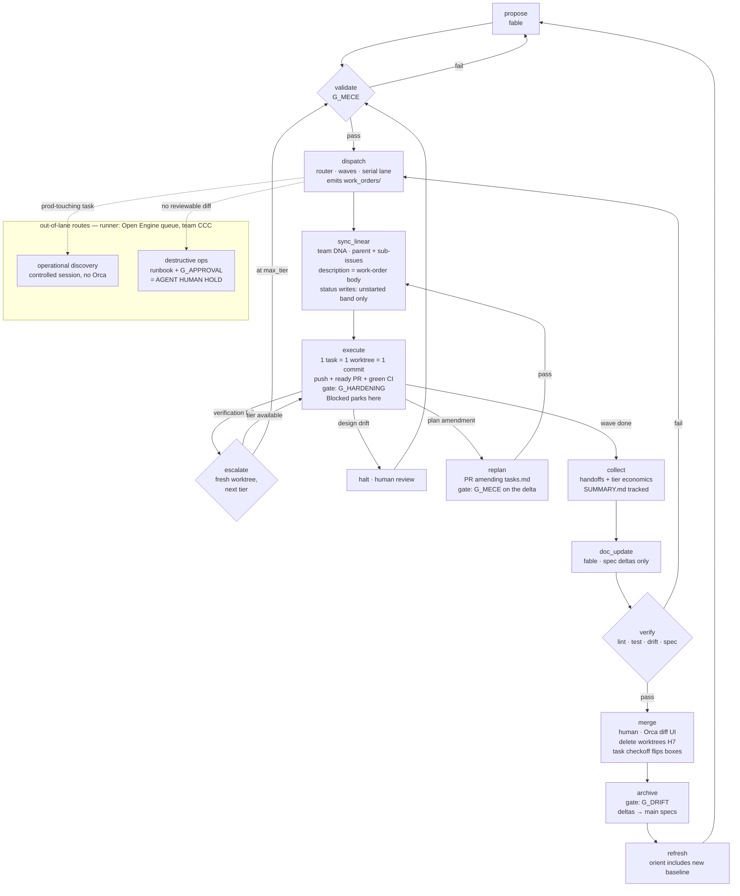

# WORKFLOW — repo-ade ADE Stack v2

**Status:** v2.1.0 — supersedes v1 WORKFLOW.md | **Owner:** Ford
**Scope:** The goal workflow for repo-ade-born repos (PULSE first), in three renderings: executable YAML (the source of truth), prose walkthrough, and diagram. The YAML block is parsed by `scripts/workflow.py` and read directly by agents via `orient()`. **Editing the YAML changes dispatch behavior. The prose and diagram are projections of the YAML — `task workflow:lint` fails if either names a step or gate the YAML does not define, or omits a step it does.** Same doctrine as the state catalog: one generative artifact, multiple emitted surfaces, CI fails on drift.

> **Projections are checked, not generated.** An earlier revision said the prose and diagram
> "regenerate from" the YAML. They do not, and should not: §3 is editorial English carrying
> judgement the YAML does not encode, and generating it would mean either losing that or
> pretending the YAML holds it. What CI enforces is correspondence — no invented steps or gates,
> no omitted ones. Edit a projection freely; just do not let it contradict the block.

> **Every target this document names now exists.** `task workflow:lint`,
> `task linear:sync CHANGE=<id>`, `task dispatch CHANGE=<id>`, `task checkoff CHANGE=<id>`,
> `task collect CHANGE=<id>`,
> `task verify CHANGE=<id>`, `task spec:archive CHANGE=<id>`. Two need credentials and degrade
> rather than fail without them: `workflow:lint:linear` skips, and `linear:sync` plans without
> mutating. `linear:sync` is dry-run by default — pass `APPLY=1` to write.

---

## 0. TL;DR

One OpenSpec change = one Linear parent issue = one directory of dispatched work orders. One task = one Linear sub-issue = one work-order file = one Orca worktree = one commit. The repo is the record, Linear is the projection — sub-issues mirror work-order files so Orca's native Linear integration can claim them, but the file is canonical and the sync is one-directional. The queue lives in the **DNA team** with standard Linear statuses; the Open Engine queue (team CCC, Agent-prefixed statuses) is a separate protocol that serves as the runner for the two out-of-lane routes. Dispatch is wave-gated with a serial lane, execution routes by model tier with an escalation ladder instead of fan-out, and four gates (hardening, MECE, drift, approval) block specific transitions. An agent anywhere in the cycle computes its next step from the `steps[].next` graph plus the `agent_protocol` state-resolution order — no ambiguity, no tribal knowledge.

## 1. Grain map

| Grain | Linear | Repo | Orca | Git |
|---|---|---|---|---|
| Program | Team **DNA** / project **Pulse 1.0** | — | — | — |
| Change | Parent issue (DNA) | `openspec/changes/<id>/` + `work_orders/<id>/` | — | Feature branches per task, merged per wave |
| Task | **Sub-issue of the parent** (DNA) | `work_orders/<id>/<task>.md` | One worktree | One commit |
| Attempt | Sub-issue comment (receipt) | HANDOFF.md Receipt block | Fresh worktree per escalation | — |

Sub-issues are the Orca claim surface: its Linear integration creates a worktree from the sub-issue, whose description *is* the dispatched work-order body. Direction of truth: the `linear:sync` target writes files → sub-issues, never back. A sub-issue edited by hand in Linear is drift and gets overwritten at next sync — spec changes go through the file.

Out-of-lane work (operational discovery, destructive ops) is executed by the Open Engine queue in team **CCC** under the `open-agent-engine` skill and its receipt-token protocol. The two teams keep disjoint status vocabularies by construction — DNA is standard Todo / In Progress / In Review, CCC is Agent Todo / Agent Working / Agent Review — so neither claim surface can see or misread the other. Cross-team dependencies are expressed as Linear issue relations (the OCN-4 ← DNA-695 block is the existing precedent).

## 2. The workflow, executable

```yaml
ade_workflow:
  version: 2.1.0
  source_of_truth: WORKFLOW.md            # this file, this block
  renderings: [prose_section_3, diagram_section_4]   # checked for correspondence, not generated
  parser: scripts/workflow.py             # thin glue; `task workflow:lint` validates this block

  linear:
    team: DNA
    project: "Pulse 1.0"                   # verified against the live workspace 2026-08-01;
                                           # DNA-695 (S0.1 scaffold) lives here
    statuses:                              # the live DNA set, verified 2026-08-01.
      - Triage                             # workflow:lint checks every status string used
      - Backlog                            # below resolves to one of these; `--linear`
      - Todo                               # checks this list still matches the team.
      - In Progress
      - Blocked
      - In Review
      - Done
      - Canceled
      - Duplicate
    status_ownership:                      # one writer per band
      unstarted: sync                      # Todo (and healing Triage -> Todo)
      started: agents_and_orca             # In Progress, Blocked, In Review
      terminal: human_via_merge_archive_plus_sync_on_checkoff
                                            # parent issue Done/Canceled: human, at merge/archive.
                                            # sub-issue Done: sync, immediately on tasks.md checkoff
                                            # -- the one terminal write sync owns; never the parent's

  state_resolution:                        # how an agent determines "where are we"
    # Every rule below reads tracked repo state or shared state (Linear, the git
    # remote) — never a gitignored local path. v2.0.3's rules keyed on work_orders/
    # staleness, a gitignored SUMMARY.md, and local worktree existence, so two
    # machines could resolve the same change to different steps. Work orders are a
    # local materialization: dispatch is idempotent, so "run dispatch" is always
    # safe when tasks are wave-eligible, and no rule needs to ask whether the
    # files exist here.
    order:                                 # first match wins
      - "openspec/changes/<id>/ absent"                          : step=propose
      - "tasks.md missing model/deps annotations or MECE unchecked": step=validate
      - "an open replan PR amends openspec/changes/<id>/tasks.md" : step=replan
      - "linear sub-issues out of sync with tasks.md"             : step=sync_linear
      - "unchecked tasks whose deps are all checked"              : step=dispatch
      - "any sub-issue status in [Todo, In Progress, Blocked]"    : step=execute
      - "any sub-issue status in [In Review]"                     : step=merge
      - "handoffs/<id>/SUMMARY.md absent from the tracked tree"   : step=collect
      - "SUMMARY.md newer than specs/ last edit"                  : step=doc_update
      - "task verify not green for <id>"                          : step=verify
      - "openspec/changes/<id>/ still present"                    : step=archive
      - default                                                    : step=propose (next change)
    # Blocked parks the change at execute — reads as "wave not done." Unblock is a
    # human comment plus a drag back to In Progress. Escalation never fires on
    # status; it fires only on verification failure.
    # A tasks.md amendment that has already merged resolves forward through
    # sync_linear and dispatch — those two rules ARE the tail of replan, so an
    # agent landing after the replan PR merged simply continues it.
    # Local worktree existence is H7 hygiene, reported at merge — never a
    # resolution input. Spent worktrees on one machine must not park the change
    # for every other machine.

  gates:
    G_HARDENING:
      checks: [H1_telemetry, H2_daemon_localhost, H3_version_pin, H4_permission_defaults]
      receipt: linear_issue_link
      rerun_on: orca_version_change
      blocks: [execute]
    G_MECE:
      checks: [every_requirement_has_scenario, tasks_atomic_2h, task_scenario_bijection_covered,
               no_scope_overlap, deps_explicit, model_declared_or_default,
               deps_reference_existing_tasks, serial_flags_justified]
      blocks: [dispatch]
    G_DRIFT:
      checks: [openlore_drift_clean, no_unreviewed_design_drift_flags]
      blocks: [archive]
    G_APPROVAL:
      applies_to: tasks_tagged_destructive_or_prod_touching
      requires: human_approved_pr        # the PR carrying the task's runbook, scripts, or
                                         # committed artifacts, approved or merged by a human.
                                         # The review IS the approval receipt. v2.0.7 replaced
                                         # the Linear-comment ceremony: comment approvals had
                                         # no acknowledgment and no validation, so they could
                                         # land on the wrong issue (or the right one) and
                                         # silently change nothing — four were lost this way.
      blocks: [execute]

  lanes:
    repo_change:
      description: default lane — everything below
    operational_discovery:
      trigger: task reads production data (BF-0b class)
      route: single controlled Claude Code session, scoped runtime creds,
             outside Orca until G_HARDENING; receipts on the Linear sub-issue
      runner: open_engine_queue            # team CCC, open-agent-engine skill,
                                           # receipts per its AGENT token protocol
      excluded_steps: [execute]            # runs as a controlled session, not an Orca worktree
    destructive_ops:
      trigger: no reviewable diff exists (force-push, repo archive, prod load)
      route: operator runbook, agent-prepared scripts, G_APPROVAL mandatory
      runner: open_engine_queue            # same runner; approval gates map to
                                           # AGENT HUMAN HOLD on the CCC issue
      excluded_steps: [dispatch, execute, merge]

  routing:
    tiers: [sonnet, opus, fable]
    default: {model: sonnet, max_tier: opus, attempts_per_tier: 2}
    rubric: verifier_strength_not_task_prestige       # see dispatch-template §3
    fan_out: exploratory_only                          # never for spec-determined tasks
    serial_lane_always: [catalog_generated_surfaces, workspace_roots, AGENTS.md, openspec_main_specs]

  main_access:                             # what may reach main without a PR
    default: pull_request                  # everything not listed below
    direct_push_allowed:
      - mechanical state updates that carry no reviewable decision — checkbox state in
        tasks.md (normally via `task checkoff`), the id tokens linear:sync writes back,
        Orca or worktree configuration
      - repairing a red main, where waiting for review costs every worktree more than
        the review would catch
    conditions:                            # all of them, on every direct push
      - task check green locally before pushing
      - touches no spec, no src/, no design/ — those are always a PR
      - in tasks.md, checkbox state and issue-id tokens are the ONLY content eligible;
        adding a task, widening scope, or changing a dependency is a decision and goes
        through replan as a PR
      - one focused commit, and the message says why it bypassed review
      - a commit that checks off a task also runs
        `task linear:sync CHANGE=<id> --apply` as part of the same mechanical
        action — the checkoff and the Linear write travel together, not as
        two separately-reviewed events; this is what makes sub-issue Done
        immediate rather than whenever someone next happens to run sync
    rationale: >
      A checkbox flip after every one of ~45 tasks is not reviewable content, and
      routing it through a PR trains people to merge their own PRs unread, which is
      worse than the bypass. The conditions keep it from widening: the moment a push
      carries a decision, it is a PR again. The checkoff bypass now carries one side
      effect on a shared system — a Linear sub-issue write, not the purely local
      change this exemption originally assumed — but that write is --apply-gated,
      idempotent (a no-op once already Done), and trivially correctable by hand if
      wrong, so the exemption still holds, on a documented basis rather than an
      implicit one.

  decision_protocol:                       # where a decision must land to count as made
    rule: >
      A decision reached outside the artifacts — in a chat, a report, a review
      thread — is not a decision until it is recorded where the tasks that inherit
      it read it. Recording it is a change or a PR, never only a message.
    homes:
      - "architecture and technology commitments -> docs/adr/ (one decision per
         ADR, alternatives with the reason each was not chosen)"
      - "sequencing and entry gates -> design/delivery/pulse-program-roadmap.md"
      - "conventions binding every agent -> AGENTS.md"
      - "decisions scoped to one change -> that change's design.md"
    record_carries: [answer, date_decided, what_it_gates]
    rationale: >
      A decision that exists only where it was made is the same hazard as an
      unmade one: the tasks that inherit it cannot see it, so each one either
      re-decides or guesses. The record carries what it gates so a task can tell
      whether the decision anticipated its situation, not only what was chosen.

  steps:
    - id: propose
      actor: human + agent(fable)
      run: '/opsx:propose "<change title>"'
      produces: [proposal.md, design.md, specs/<capability>/spec.md, tasks.md]
      next: validate

    - id: validate
      actor: human + agent(fable, review-assist)
      run: openspec validate <id>
      gate: G_MECE
      next: {pass: dispatch, fail: propose}   # revise docs, re-validate

    # dispatch precedes sync_linear: the sub-issue description IS the work-order
    # body, so the files must exist before Linear can be written. linear_sync.py
    # enforces this — it hard-errors when work_orders/<id>/ is absent. Ordered the
    # other way until v2.0.5, which made sync_linear unrunnable at its declared
    # position; state_resolution had the right order the whole time.
    - id: dispatch
      actor: tool + router
      run: task dispatch CHANGE=<id>
      behavior: emit work_orders/<id>/<task>.md per dispatch-template v1;
                release only wave-eligible tasks (deps merged);
                serial-lane tasks release alone
      next: sync_linear

    - id: sync_linear
      actor: tool
      run: task linear:sync CHANGE=<id>
      requires: work_orders/<id>/ emitted by dispatch
      behavior: create parent issue if absent (team and project per linear block,
                passed explicitly on every mutation — never inferred from API-key
                context); create/update one sub-issue per task, description =
                dispatched work-order body;
                status writes — pass stateId explicitly on create (resolve DNA
                "Todo" once per sync run, never rely on team default or triage
                intake); heal Triage -> Todo on update; never write any
                started or completed status (In Progress onward is
                agent/Orca-owned per status_ownership);
                files canonical, one-directional — with ONE sanctioned reverse
                edge, which is that after a create succeeds on an APPLY run, sync inserts the
                issue-id token [<TEAM>-<n>] into that task's line in tasks.md.
                Id tokens only, never rewritten once present, never any other
                content; dry runs print the pending write-back and write nothing
      next: dispatch

    - id: dispatch
      actor: tool + router
      run: task dispatch CHANGE=<id>
      behavior: emit work_orders/<id>/<task>.md per dispatch-template v1;
                release only wave-eligible tasks (deps merged);
                serial-lane tasks release alone
      next: execute

    - id: execute
      actor: agent(per work-order model field)
      per: task
      gate: [G_HARDENING, G_APPROVAL if tagged]
      run: |
        orca worktree create <task>          # or claim sub-issue via Orca Linear panel
        agent reads AGENTS.md, calls orient(), reads spec_refs,
        tests first, implements, task lint && task test,
        writes HANDOFF.md (Receipt + Spec deltas), one commit, push,
        gh pr create --base main (ready for review — never --draft),
        gh pr checks --watch until green; red CI is the agent's to fix, not the
        reviewer's to discover. Ship without being asked: a finished task that
        stops at a local commit is an unfinished task
      linear_status: In Progress -> In Review
      next: {verification_pass: collect,      # collect runs once the whole wave is done
             verification_fail: escalate,
             design_drift: halt,              # per decision table
             plan_amendment: replan}          # new/widened/re-wired tasks discovered mid-wave

    - id: replan
      actor: human + agent(fable)
      trigger: mid-change discovery — a missing task, a task that needs widening,
               a dependency edge that proved wrong
      run: task replan CHANGE=<id>, then a PR amending openspec/changes/<id>/tasks.md
      gate: G_MECE                          # delta-scoped — the amended and added tasks
                                            # only, never a revalidation of the whole file
      behavior: the amendment is a decision, so it is a PR — never a direct push
                (main_access names checkbox state and id tokens as the only
                tasks.md content eligible there). In-flight tasks are unaffected;
                the merged amendment flows through sync_linear and dispatch for
                the delta
      next: {pass: sync_linear, fail: replan}   # revise the amendment, not the change

    - id: halt
      actor: human
      behavior: design drift stops the worktree and flags for review — never auto-applied.
                The reviewer either amends the spec (a defect, back to validate) or clears
                the flag as a misread and lets the task continue
      next: {spec_defect: validate, cleared: execute}

    - id: escalate
      actor: router
      behavior: after attempts_per_tier failures, redispatch identical order +
                escalation-context section at next tier in a FRESH worktree;
                receipt every attempt on sub-issue and HANDOFF
      next: {tier_available: execute, at_max_tier: validate}   # ceiling failure = spec defect

    - id: collect
      actor: tool
      run: task collect CHANGE=<id>
      produces: [handoffs/<id>/*, SUMMARY.md with tier economics]
      behavior: handoffs/<id>/SUMMARY.md is TRACKED — it is the receipt record
                the escalation ladder is priced against, and it must survive the
                workstation. Per-task HANDOFF scratch stays ignored. Content is
                receipts and spec deltas only — never operational detail, never
                PHI (review-reject)
      next: doc_update

    - id: doc_update
      actor: agent(fable, fresh worktree)
      behavior: apply ONLY plan-relevant deltas to openspec/changes/<id>/specs/;
                run openspec validate; design-drift flags route to human, never auto-applied
      next: verify

    - id: verify
      actor: tool
      run: task verify CHANGE=<id>          # lint, test, drift, spec validation
      next: {pass: merge, fail: dispatch}     # fix via redispatched tasks, not hand edits

    - id: merge
      actor: human
      surface: orca_diff_review_ui
      behavior: annotate hunks, merge winners to main, delete spent worktrees (H7 —
                hygiene on the owning machine, never a state_resolution input);
                task checkoff CHANGE=<id> flips the merged tasks' boxes (the act
                that opens the next wave — automated, batchable, main_access-
                eligible); linear sub-issues -> Done
      merge_method: merge_commit for anything carrying imported history;
                    squash is fine for ordinary work. A squashed subtree import
                    silently destroys the history it existed to preserve and looks
                    identical in the diff — see the 1.2 import, ADR §6.1
      next: archive

    - id: archive
      actor: tool
      gate: G_DRIFT
      run: task spec:archive CHANGE=<id>
      behavior: deltas merge to openspec/specs/, change folder cleaned,
                parent issue -> Done with receipts
      next: refresh

    - id: refresh
      actor: tool
      behavior: orient() now includes archived specs; next change starts clean
      next: propose

  edit_protocol:
    - "workflow changes are changes: edit this YAML via its own OpenSpec change
       (meta-change), or for single-step tweaks a direct PR touching only WORKFLOW.md"
    - "task workflow:lint validates schema, step-id references, gate references, lane
       excluded_steps, and that every status string in state_resolution and linear_status
       is one linear.statuses declares — `--linear` checks that set against the live team"
    - "prose and diagram are projections: workflow:lint fails if either names a step or gate
       the YAML does not define, or omits a step it does. The prose is editorial and is not
       machine-generated — see the note under renderings"
    - "step ids are stable identifiers — add/remove steps freely, never repurpose an id"
```

## 3. Prose walkthrough (projection of §2)

A change begins at **propose**: OpenSpec scaffolds the change folder, Fable-tier assistance shapes proposal, design, specs, and tasks. **Validate** runs the tool check plus the extended MECE gate — scenarios cover tasks, tasks are atomic, dependencies explicit, every task carries or defaults its model and parallel flags. Failure loops to propose, and nothing dispatches until G_MECE holds.

**Sync-linear** projects the plan into Linear: one parent issue for the change and one sub-issue per task, all in the DNA team under the PULSE / Declared-State Funnel project, with team and project passed explicitly on every mutation. Sub-issue descriptions are the work-order bodies. Status writes follow the one-writer-per-band rule: sync resolves DNA's Todo state ID once per run and passes it on every create so triage intake can never intercept a new sub-issue, heals only the Triage→Todo edge on updates, and never touches anything from In Progress onward — that band belongs to agents and Orca, and the terminal band belongs to humans at merge and archive. The repo is the record and the sync is one-directional — Linear is where humans watch, comment, and approve, not where specs live. One reverse edge is sanctioned, because the id is the one fact Linear mints: after a create succeeds on an apply run, sync writes the `[DNA-nnn]` token back into that task's line in tasks.md — id tokens only, never rewritten once present, never any other content. The first real change spent whole commits hand-copying those ids, and hand-copying is how they drift. **Dispatch** then emits the work-order files per the dispatch template, releasing tasks in waves as dependencies merge, with serial-lane tasks (generated surfaces, workspace roots) running alone.

**Execute** is one agent per task per worktree, claimed through Orca's Linear panel or the CLI, gated on hardening (and, for anything tagged destructive or prod-touching, on a human-approved PR carrying the task's runbook or artifacts — those tasks actually leave this lane entirely, per the lanes block). The agent orients, writes tests first, implements, verifies, writes a HANDOFF with its receipt, and commits once — then ships that commit without being asked: push, open a PR against main **ready for review, never a draft**, and watch `gh pr checks` to green. Red CI belongs to the agent that made it red, not to the reviewer who finds it. A draft PR is the same failure in a quieter form: it withholds finished work from the review step that is supposed to consume it, and reads as "still working" when nobody is. The task is done when the diff is on a green, reviewable PR — a finished task parked at a local commit is an unfinished task. Verification failure feeds **escalate**: two attempts per tier, fresh worktree per rung, and failure at the ceiling returns the task to validate as a spec defect rather than a bigger-model problem. Design drift halts the worktree and flags for human review. A sub-issue dragged to Blocked parks the change at execute — state resolution reads Blocked as "wave not done," the unblock path is a human comment plus a drag back to In Progress, and escalation never fires on status, only on verification failure.

Mid-change discovery — a missing task, a task that needs widening, a dependency edge that proved wrong — takes the **replan** edge. The amendment is a decision, so it is a PR against `tasks.md`, checked by G_MECE over the delta only (revalidating a fifty-task file to add two tasks is exactly the friction that used to push amendments straight to main), then flows through sync-linear and dispatch while in-flight tasks continue undisturbed. The first real change hit this at least eight times with no legal edge for it; now it has one, and `main_access` is correspondingly narrower — checkbox state and issue-id tokens are the only tasks.md content that may reach main without review.

The two out-of-lane routes have a named runner: the Open Engine queue in team CCC, executed under the open-agent-engine skill with its AGENT receipt tokens. Operational discovery (anything reading production data) runs as a single controlled Claude Code session with scoped credentials, receipts on the issue. Destructive ops (anything with no reviewable diff — force-pushes, repo archives, production loads) run as operator runbooks with agent-prepared scripts, where G_APPROVAL maps onto the skill's AGENT HUMAN HOLD gate. The CCC team keeps its Agent-prefixed statuses and the DNA team keeps standard ones, so the two claim surfaces are mutually invisible by construction, and cross-team dependencies ride ordinary Linear issue relations.

When the wave completes, **collect** gathers handoffs and the tier-economics summary — and `handoffs/<id>/SUMMARY.md` is tracked, because a receipt record that lives only on one workstation is not a record; per-task scratch stays ignored, and the summary carries receipts and spec deltas only, never operational detail or PHI. **Doc-update** folds spec-relevant deltas back into the change specs in a fresh Fable worktree, and **verify** runs the full quality gate — failures route back through dispatch as new or reopened tasks, never as hand edits to worktree output. **Merge** is the human moment: Orca's diff review, hunk annotation, winners to main, spent worktrees deleted — a hygiene step (H7) on the machine that owns them, never something another machine's state resolution waits on. `task checkoff` then flips the merged tasks' boxes from main's own history, which is the act that opens the next wave — the first real change hand-typed twenty-five of those commits, and none of them carried anything a reviewer could review. Squash is the normal method, but anything carrying imported history takes a merge commit — a squashed subtree import destroys the history it existed to preserve and looks identical in the diff. **Archive** (gated on clean drift) folds delta specs into the baseline and closes the parent issue with receipts, and **refresh** means the next change's `orient()` already knows everything this one shipped.

State resolution now reads tracked or shared state only — tasks.md, the tracked SUMMARY.md, Linear, the git remote — so any agent on any clone computes the same step. Work orders are a local materialization dispatch can always regenerate, and worktree existence never parks a change.

Two narrow things may reach main without a PR, per `main_access`: mechanical state updates that carry no reviewable decision — checking off a completed task, Orca or worktree configuration — and repairing a red main, where waiting on review costs every worktree more than the review would catch. The conditions are what keep that from widening: `task check` green first, nothing under `specs/`, `src/` or `design/`, one focused commit, and a message that says why it skipped review. A checkbox flip after each of ~45 tasks is not reviewable content, and routing it through a PR mostly teaches people to merge their own PRs unread. The moment a push carries a decision, it is a PR again.

Decisions themselves have a landing rule, per `decision_protocol`: a decision reached outside the artifacts — in a chat, a report, a review thread — is not a decision until it is recorded where the tasks that inherit it read it, and recording it is a change or a PR, never only a message. Architecture and technology commitments go to `docs/adr/`, sequencing and entry gates to the program roadmap, conventions binding every agent to `AGENTS.md`, and change-scoped decisions to that change's `design.md`. The record carries the answer, the date, and what it gates — a decision that exists only where it was made is the same hazard as an unmade one, because the tasks that inherit it cannot see it.

## 4. Diagram (projection of §2)



## 5. What changed from v1

Sub-issue grain added (Linear parent/sub mapping to change/task, one-directional sync, Orca claims sub-issues). Model routing and the escalation ladder embedded in dispatch and execute. Gates made explicit objects with named blocking edges (hardening, MECE-extended, drift, approval). Lanes formalized so prod-touching and destructive work route out of Orca by rule instead of by memory. State-resolution order added so an agent landing mid-change computes its step deterministically. Edit protocol added: this YAML is the workflow, renderings regenerate, step ids are stable.

## Change log

**v2.1.0 (2026-08-27):** Four rules the ocean-eventbridge-migration run (56 tasks, 58 PRs) proved
were missing, shipped as OpenSpec change `workflow-v2-1-efficiency`. (1) **`replan`** — mid-change
plan amendment as a first-class step: a PR amending tasks.md, G_MECE over the delta only, then
sync and dispatch. The run amended tasks.md at least eight times through an edge that did not
exist, and several of those direct pushes carried scope decisions `main_access` forbids — the
graph forced the breach it prohibited. `main_access` is correspondingly tighter: checkbox state
and issue-id tokens are now the only tasks.md content eligible for direct push. (2) **`task
checkoff`** — the merged-PR-driven checkbox flip. Twenty-five of the run's ~100 main commits were
hand-typed `chore: check off` bookkeeping, each one load-bearing because dispatch reads checked
boxes to release waves. (3) **Id write-back** — `linear:sync` gains one sanctioned reverse edge,
inserting the Linear-minted `[DNA-nnn]` token into the task's line on create; whole commits had
existed only to record ids by hand. (4) **Tracked state resolution** — every `state_resolution`
rule now reads tracked or shared state; `handoffs/<id>/SUMMARY.md` is tracked (it is the
tier-economics receipt record, and it had been gitignored — the escalation ladder's own evidence
never entered the repo); worktree existence demoted from resolution input to H7 hygiene. No step
id repurposed, per `edit_protocol`.

**v2.0.3 (2026-08-01):** Two rules the first real run of this workflow proved were missing. (1) **`main_access`** — a narrow, conditioned exemption from the PR flow for mechanical state updates (checking off a completed task, worktree configuration) and for repairing a red main. Written because the alternative was worse than the bypass: a checkbox flip after each of ~45 tasks is not reviewable content, and routing it through a PR trains people to merge their own PRs unread. The conditions — green `task check`, nothing under `specs/`/`src/`/`design/`, one commit, a message saying why — are what stop it widening, and anything carrying a decision is a PR again. (2) **`merge_method`** on the merge step: squash for ordinary work, merge commit for anything carrying imported history. The repo was configured squash-only, and squashing the 1.2 subtree import would have collapsed 193 preserved commits into one — destroying precisely the audit posture ADR §6.1 exists for, failing the task's own post-condition, and looking completely fine in the diff.

**v2.0.2 (2026-08-01):** The block became executable, and doing so found four defects that had been invisible because nothing read it. (1) **The YAML did not parse.** An `edit_protocol` list item contained a bare `key: value`, which YAML read as a mapping whose key then spanned two lines. Two revisions declared this block "parsed by thin glue" and the source of truth while it could not be loaded at all — quoted now, and `scripts/workflow.py` plus `task workflow:lint` exist and run inside `task check`. (2) **`execute` handed off to two steps that did not exist**, `collect_when_wave_done` and `halt_and_flag`. The first is `collect` with a condition attached; the second named a real node the diagram and prose both describe but the steps list never defined, so `halt` is now a step with its own `next` edges. (3) **`operational_discovery.excluded_steps` named `execute_in_orca`**, not a step id — the same class of defect that let dispatch emit work orders for destructive ops. Now `execute`. (4) **`linear.project` pinned "PULSE / Declared-State Funnel", which does not exist**; the real project is "Pulse 1.0", where DNA-695 lives. The status set was a YAML *comment*, so v2.0.1's claim to have verified it could never be rechecked — promoted to `linear.statuses`, which the offline lint validates every status string against and `workflow:lint:linear` verifies against the live team, project included. Also: the header's "prose and diagram regenerate from YAML" is withdrawn as unachievable and replaced by a correspondence check — §3 is editorial English, and generating it would mean losing judgement the YAML does not encode.

**v2.0.1 (2026-08-01):** Team separation and status hardening. (1) Queue pinned to team **DNA**, project **PULSE / Declared-State Funnel** — the Open Engine queue keeps team CCC with its Agent-prefixed statuses, and the two protocols are now disjoint by construction (new `linear` block, grain map updated). (2) `runner: open_engine_queue` annotated on both out-of-lane routes, with G_APPROVAL mapped to the skill's AGENT HUMAN HOLD gate. (3) `Blocked` added to the state-resolution execute check — a Blocked sub-issue parks the change at execute; unblock is a comment plus a drag back to In Progress; escalation fires on verification failure only, never on status. (4) Status-write contract made explicit in `sync_linear`: stateId passed explicitly on create (resolved once per sync run, never team default), Triage→Todo healed on update, started/terminal bands never written by sync — codified as `status_ownership` (sync owns unstarted, agents/Orca own started, humans own terminal). (5) `workflow:lint` extended to verify every referenced status string exists in the pinned team's status set. Verified against DNA's live status set 2026-08-01: Triage, Backlog, Todo, In Progress, Blocked, In Review, Done, Canceled, Duplicate.

**v2.0 (2026-08-01):** Rewrite as source-of-truth YAML with prose and diagram as projections. Supersedes v1 WORKFLOW.md.
