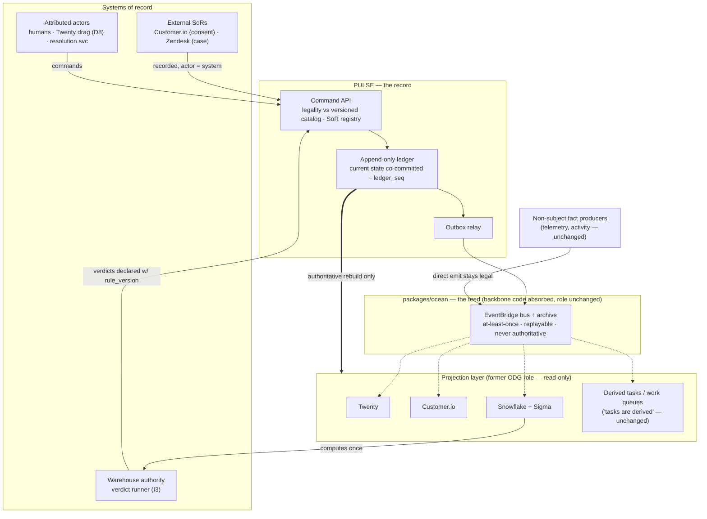

# ADR: Absorbing OCEAN into the PULSE Ledger Foundation

**Status:** Proposed — repo reconciliation complete (§9, 2026-08-01); all four §9.1 failures closed 2026-08-01 (V3 → EventBridge migration; V5 → convention + CI schema check; V7 → named migration M1, §6.2; V11 → filtered import, §6.1); pending Tal sign-off
**Date:** 2026-07-31 (rev 2 — absorption framing)
**Deciders:** Ford (author), Tal (sign-off).
**Scope:** How the OCEAN pattern and codebase (event backbone + Operational Data Graph, "events are facts, tasks are derived") are absorbed into PULSE (Patient Unified Ledger of State and Events). PULSE is OCEAN's only application — doctrine has shifted wholly to declarative, so OCEAN is not amended for one domain, it is superseded and its code migrates into the PULSE repo as the distribution subsystem. One project, one repo, one doctrine.
**Inputs:** `rpc-object-model-assessment.md` v0.7 (pinned vocabulary §1, invariants I1–I9, spine §4.3), `DNA-SPEC-DECLARED-STATE-PRM`, prior OCEAN/PULSE reconciliation (design-rationale thread, 2026-07-31). The OCEAN repo was not readable at authoring time; §9 records the reconciliation performed against it on 2026-08-01, and §9.1 the four assumptions that failed.

---

## 0. TL;DR

OCEAN has exactly one application, and it is PULSE. That fact retires the original framing — OCEAN as platform doctrine that PULSE amends with a patient-state carve-out — because there is no platform left to carve out from. The thinking has shifted wholly to declarative (not inferred), so OCEAN's derive-in-the-graph doctrine is superseded, not amended, and the OCEAN codebase migrates into the PULSE repo as the distribution subsystem once that repo exists (S0.1). What survives is a three-way decomposition of the pattern: **replace** the backbone transport — OCEAN runs Kafka/MSK today, and it migrates to EventBridge so that one bus serves both the absorbed services and the PULSE outbox (§9.1 V3) — with the relay, archive and fan-out role itself unchanged; the package becomes a PULSE workspace package, **repurpose** the Operational Data Graph (ODG) as a read-only projection layer rebuilt from the ledger rather than a derivation layer built from the feed, and **forbid** two OCEAN idioms outright — producers emitting state-bearing events directly onto the bus, and any consumer treating the bus or its archive as the record.

The single sentence that governs everything: **the ledger is the record, the backbone is the feed.** Commands enter the ledger through one writer with transition legality checked against the versioned catalog, current state co-commits with the event, and the outbox publishes an OCEAN-conformant envelope onto the backbone after commit. External systems of record (Customer.io per D9, Zendesk for Case) keep adjudicating their own state — the ledger records their transitions as attributed events and never blocks them. OCEAN's task-derivation motto survives untouched: tasks were always supposed to be derived, and now they derive from declared state instead of reconstructed state.

The plan lands in four phases aligned to the existing S0–S4 delivery sequence, adds a repo-absorption step to Phase 0/1 (history-preserving import of the ocean repo into the PULSE monorepo, then archive the source), produces one doctrinal artifact (the supersession notice, drafted in §7), and carried eleven repo-verification items (§9) because the repo was unreadable when it was written — since reconciled, with four failures recorded in §9.1. Absorption also resolves the compliance placement problem for free: the code leaves the personal `robford-brookai` account by import rather than org transfer. V3, the one open item that changed the plan's shape, is settled: retire Kafka, migrate to EventBridge (§9.1), delivered as the OpenSpec change `ocean-eventbridge-migration`. Recommended next action: fold this ADR's §4 contract into `DNA-SPEC-DECLARED-STATE-PRM` alongside the object-model section.

---

## 1. Context

### 1.1 The two artifacts

**OCEAN** is the event architecture originally framed at platform level: an event backbone (records what happened — at-least-once, replayable, many consumers) and an Operational Data Graph (answers current state, derived from backbone facts). Its motto is "events are facts, tasks are derived." Its doctrine, as written, is that state is derived in the graph. As of this ADR, OCEAN has one application — PULSE — and no other adopter is planned. That demotes it from platform doctrine to subsystem, and the demotion is the decision this document executes.

**PULSE** is the Patient Relationship Management (PRM)-scoped declared-state ledger: a command API over an append-only Postgres ledger with a single-writer rule, transition legality enforced at write time against the versioned state catalog, current state co-committed with each event, and an outbox relay to EventBridge with Snowflake, Twenty, and Customer.io as projection consumers.

### 1.2 The tension, named

OCEAN's derive-in-the-graph doctrine is, for patient state specifically, the Enrichment-as-Record anti-pattern promoted one layer up. If patient status is reconstructed by graph consumers from a feed of side-effect events, nothing has changed except where the inference runs. The live production symptoms (status disagreements across systems, patients missing from onboarding views, funnel counts requiring fresh analysis each time) are the cost of that doctrine applied to state that is too load-bearing to be a query result.

The prior reconciliation (2026-07-31 design thread) resolved the conceptual mapping: PULSE promotes patient state from *derived in the graph* to *declared into the backbone*. An earlier revision of this ADR planned a one-paragraph carve-out amendment to the OCEAN paper, per the follow-on the assessment's §8 registers. That plan is withdrawn: with PULSE as OCEAN's sole application, a carve-out that covers the entire application surface is a supersession wearing an amendment's clothes. This ADR does the honest version — supersede the paper (§7), absorb the code (§6), retire the second doctrine. It also lances the naming-proliferation risk already flagged as a finishing hazard: OCEAN stops being a project name and becomes a package name.

### 1.3 Constraints inherited as locked

- Declared, not inferred. Patient state fires real, traceable events into a ledger — never reconstructed from metadata across systems.
- State is given by its system of record (SoR). Exactly one system adjudicates each state. PULSE either owns the machine or records the external SoR's transitions with attribution (the D9 pattern).
- Single-writer rule on the ledger. One authoritative write path, hard constraint.
- Invariants I1–I9 from the object-model assessment, especially I2 (one home per status) and I3 (derived-then-declared verdicts, computed once in the warehouse authority).
- Warehouse as reconciliation referee between operational systems.
- Infrastructure: AWS-DuploCloud EKS for the PULSE service, EventBridge as the relay target, Snowflake + Snowpark Container Services (SPCS) on the projection side, C1 gate (executed Snowflake Postgres Business Associate Agreement) governing production Protected Health Information (PHI) in the Twenty database.

---

## 2. Decision

Two coupled decisions, one topology and one repository.

**Topology:** adopt the **record-versus-feed split**: PULSE ledger as the book of record for the six PULSE subject types (Referral, Consent, Enrollment, BillingEpisode, Device, Contract) plus recorded external state (CommunicationConsent), with the OCEAN backbone retained in the distribution role and the ODG reconstituted as a read-only projection layer. Formalized as (a) an envelope contract extension (§4.2), (b) an SoR registry in the state catalog (§4.3), and (c) a producer policy that converts state-bearing emits into commands (§4.4).

**Repository:** absorb the OCEAN codebase into the PULSE monorepo as the distribution package when the repo is scaffolded (S0.1 / DNA-695), with history preserved, the source repo archived, and the OCEAN paper superseded by a notice pointing here (§7). OCEAN survives as a package name, not a project name. Since PULSE is the sole application, doctrine is singular: declared, not inferred, everywhere.

---

## 3. Options considered

### Option A — PULSE as pure OCEAN consumer (doctrine unchanged)

Producers keep emitting events onto the backbone. PULSE, if it exists at all, is one more graph node deriving patient state from the feed.

| Dimension | Assessment |
|---|---|
| Complexity | Low — nothing changes |
| Declared-state fit | ✗ Fails outright. State remains a reconstruction, now with a new name |
| SoR discipline | ✗ No adjudication point. Two consumers can disagree about a status, violating I2 |
| Transition legality | ✗ Unenforceable — no write-time gate exists on a bus |
| Audit posture | △ Events are attributed but transitions are not validated |

**Pros:** zero migration, no doctrine change.
**Cons:** it is the current failure mode with extra steps. Every design goal of the program is unmet.

### Option B — PULSE ledger replaces the backbone for PRM

The ledger becomes both record and distribution. Consumers read the ledger directly (change data capture or polling), EventBridge exits the PRM picture.

| Dimension | Assessment |
|---|---|
| Complexity | Medium — but couples every consumer to ledger internals |
| Declared-state fit | ✓ Record semantics are correct |
| Distribution | ✗ Loses EventBridge fan-out, archive, replay, cross-account routing. Every consumer needs read credentials into the transactional database |
| Blast radius | ✗ A slow consumer becomes a transactional-database load problem. Read isolation between the record and its consumers disappears |
| Sunk investment | ✗ Discards working, provisioned backbone code (relay, archive, replay, IaC) to rebuild distribution inside the ledger service |

**Pros:** one system, no relay lag, strongest consistency for consumers.
**Cons:** conflates record and feed in the opposite direction — the feed becomes the record's problem. Violates the boring-infrastructure preference for no reason. Note this option is *not* what "absorb OCEAN into the PULSE repo" means: absorption moves the code, not the topology — the bus keeps its job from inside the monorepo.

### Option C — Record-versus-feed split (recommended)

Ledger is the record. Outbox relays committed events onto the backbone in OCEAN-conformant envelopes. Backbone stays exactly what OCEAN built it to be — distribution, at-least-once, replayable, never authoritative. ODG components become projections rebuilt from the ledger.

| Dimension | Assessment |
|---|---|
| Complexity | Medium — outbox relay plus envelope extension, both already scoped in PULSE architecture |
| Declared-state fit | ✓✓ Write-time legality, co-committed state, attributed transitions |
| SoR discipline | ✓✓ One adjudicator per state, external SoRs recorded per D9 |
| Distribution | ✓ Full reuse of backbone infrastructure, archive, replay, existing consumer patterns |
| Platform coherence | ✓ OCEAN envelopes on the OCEAN bus. Consumers cannot tell PRM events changed provenance — they only gained guarantees |

**Pros:** maximal reuse, consumers migrate without code changes to their subscription mechanics, and the codebase moves cleanly — the backbone imports as a self-contained package because its interface (envelopes on a bus) is already the package boundary.
**Cons:** relay lag between commit and publication (bounded, monitored — §4.5), and two replay paths that must be disciplined (§4.6) or the archive quietly becomes a second record.

**Verdict: Option C.** It is the only option where both halves of the existing investment survive — PULSE's guarantees and OCEAN's plumbing — and the only one where absorption is a `git` operation rather than a rewrite.

---

## 4. The adapted pattern

### 4.1 Pattern decomposition — keep, repurpose, forbid

Every element of the OCEAN pattern gets exactly one disposition. This table is the adaptation.

| OCEAN element | Disposition | Rationale |
|---|---|---|
| Event bus, rules, fan-out | **Replace (transport), keep (role)** | The distribution *role* was never the problem; the *transport* is not what this ADR assumed. OCEAN runs Kafka — Redpanda locally, MSK Serverless on AWS — and migrates to EventBridge + SQS per the V3 decision (§9.1). Consumers become one rule → one SQS queue each, preserving competing-consumer semantics |
| Event archive + replay tooling | **Build, re-scoped** | Not "keep" — OCEAN has none (§9.1 V8: no replay CLI, script or target). EventBridge archive supplies it. Convenience replay for projection rebuilds only; authoritative rebuilds read the ledger (§4.6) |
| Envelope schema and naming conventions | **Keep, extended** | PULSE events ride the same envelope with a mandatory extension block (§4.2). Existing consumers parse them unchanged |
| Consumer registration / subscription patterns | **Keep** | Twenty projector, Customer.io sync, Snowflake ingestion all subscribe as ordinary OCEAN consumers |
| "Tasks are derived" | **Keep, unchanged** | The half of the motto that was always right. Tasks, work queues, and next-actions derive from declared state instead of reconstructed state — the derivation gets a better input, not a different doctrine |
| Operational Data Graph as current-state answerer | **Repurpose** | Becomes the projection layer: read-only, rebuildable from the ledger, never authoritative. With PULSE as the sole application there is no residual derive-in-the-graph role — the ODG concept fully collapses into "projections" |
| Producer libraries emitting domain events | **Repurpose** | For PULSE subjects, producers become **ingress adapters**: they translate external signals into commands against the PULSE API. The ledger emits the event after commit. For non-subject facts (telemetry, non-catalog activity) direct emits remain legal |
| "Events are facts" for state-bearing events | **Forbid (for PULSE subjects)** | A state transition emitted from a side effect is an unvalidated claim, not a fact. Facts about PULSE-subject state are minted by the ledger and only the ledger |
| Bus or archive as record ("OCEAN event store") | **Forbid** | The named hazard. Any consumer reconstructing PULSE-subject truth from the feed reintroduces enrichment-as-record one layer up |

### 4.2 Envelope contract extension

PULSE events publish in the standard OCEAN envelope so existing routing and consumers keep working, with a mandatory `pulse` extension block in the detail payload:

```
detail:
  pulse:
    subject_type:      enrollment | referral | consent | billing_episode | device | contract | communication_consent
    subject_id:        <ledger subject key>
    person_key:        <TIDE key>            # identity join, never carries state (I1)
    transition:        {from_state, to_state}
    reason:            CodeableConcept        # mandatory where the catalog says so (I4)
    actor:             {type: human|system|model, id, attribution}
    catalog_version:   <semver of the state catalog validating this transition>
    rule_version:      <present iff verdict event, per I3>
    ledger_seq:        <monotonic per subject> # total order authority
    provenance:        {source_system, evidence_ref, ingress_ref}
```

Contract rules:

1. `ledger_seq` is the ordering authority. EventBridge delivery is at-least-once and unordered — consumers deduplicate and order on `(subject_id, ledger_seq)`, never on delivery time.
2. Value objects use FHIR datatypes (I5): reasons are CodeableConcepts, periods are Periods, quantities carry Unified Code for Units of Measure (UCUM) units.
3. The envelope is generated from the state catalog (the fifth generated surface, joining Twenty metadata, FHIR Shorthand, warehouse seeds, and command API types from the assessment's §7). Continuous integration fails on drift between the envelope schema and the catalog version, same as every other surface.
4. Verdict events carry `rule_version` and input lineage, actor type `model` — the derived-then-declared discipline (I3) made visible on the wire.

### 4.3 The SoR registry — "state given by system of record," formalized

The design goal generalizes D9 into catalog metadata. Every state machine in the catalog declares its authority:

| Authority mode | Meaning | Instances |
|---|---|---|
| `pulse` | Ledger owns the machine. Transitions enter only through the command API, legality enforced at write | Referral, Consent, Enrollment, BillingEpisode, Device, Contract |
| `external(system)` | Named external system adjudicates. Ledger records every transition as an attributed event (actor = the system) and never blocks or adjudicates. Reconciliation sweep compares ledger history to the SoR's export and declares corrections (actor = reconciliation) | CommunicationConsent → Customer.io (D9). Case → Zendesk (mirror, no ledger machine) |
| `warehouse` | Verdict machines. Computed once in the warehouse authority (dbt, per D1), declared to the ledger with rule_version and lineage | Qualification, Eligibility, BenefitsVerification, MarketingClearance, BillingEpisode qualified/not_qualified |

Registry rules: exactly one authority per machine (I2 at the system level). Changing an authority is a catalog version bump, reviewed like a schema change. Ingress adapters for `external` machines are generated against the registry, so a new external SoR is configuration plus one adapter — not doctrine.

### 4.4 Producer policy — the migration's sharp edge

The one behavioral change existing OCEAN producers experience:

- **If your event asserts a PULSE-subject state transition:** stop emitting it. Issue a command to the PULSE API instead. The ledger validates, commits, and emits the event onto the backbone for you. Your emit becomes a request.
- **If your event is a non-subject fact** (a reading landed, a call completed, a document arrived): keep emitting directly. Nothing changes.
- **The classification test:** does the event's payload name a state that lives in the catalog? Then it routes through the ledger. The catalog is the boundary, mechanically checkable in CI against producer event schemas.

Sanctioned command sources per the existing register: the Twenty kanban webhook (D8, heal-back on invalid drags), Customer.io consent ingress (D9), the identity-resolution service (§5.3 of the assessment), the warehouse verdict runner (I3), and human actors through attributed tooling.

### 4.5 Delivery semantics

- Ledger → outbox → EventBridge → (SQS queue per consumer) is transactional-outbox: no committed transition is ever unpublished, no uncommitted transition ever publishes. Relay lag is monitored with an alert threshold (target well under the fastest downstream cadence — Twenty projection is the tightest consumer, per the D8 heal-back seconds budget).
- Consumers are idempotent on `(subject_id, ledger_seq)` and tolerate reorder. Projections apply monotonically — a stale event for a subject already past that sequence is dropped, not applied.
- Backbone remains at-least-once. Exactly-once is achieved at the projection, not on the wire — the standard boring answer. SQS standard queues do not preserve order either, which is why the reorder tolerance above is load-bearing rather than defensive.

### 4.6 Two replay paths, one rule

- **Authoritative rebuild:** read the ledger. This is the only path that reconstructs truth, and the only path used for a projection bootstrap or a corruption recovery.
- **Convenience replay:** EventBridge archive replay, for re-driving a consumer that missed a window. Legal only when the consumer's idempotency makes the result identical to a ledger rebuild.
- The forbidden third path — treating the archive as the record — is prevented structurally: archive events carry `catalog_version` and `ledger_seq`, and any consumer state that cannot cite a ledger sequence fails the reconciliation sweep.

### 4.7 The adapted picture



Solid arrows are writes and commands, dashed are feed consumption, the double arrow is the bootstrap/recovery path that only ever reads the ledger.

---

## 5. Trade-off analysis

- **Relay lag versus read isolation.** Option C accepts commit-to-publication lag to keep consumers off the transactional database. The lag is bounded, monitored, and already accounted for in the D8 heal-back budget. The alternative (Option B) trades a measured seconds-scale lag for an unmeasured operational coupling.
- **Two replay paths versus one.** Genuine added discipline cost. Mitigated structurally (§4.6) rather than by policy memo.
- **Producer migration friction versus doctrinal purity.** The producer policy (§4.4) is the only change that touches existing code. Scoping it by the catalog boundary keeps the blast radius to producers that were asserting patient state from side effects — which is precisely the population that needed to stop.
- **Superseding doctrine versus maintaining it.** With one application, a standalone OCEAN paper is a second doctrine document guaranteed to drift from the implementation. Superseding it (§7) and moving the code into the PULSE repo makes the implementation and its doctrine co-versioned — one repo, one CI, one place a reviewer looks.
- **Absorption cost versus org-transfer cost.** Absorbing the code via history-preserving import is strictly cheaper than the alternative for the ocean repo (org transfer + rob-repo factory-subset retrofit): the PULSE repo is born conformant by the rob-repo ritual, so the imported package inherits conformance instead of being retrofitted into it. One repo exits the personal-account remediation list without ever entering the retrofit queue.

---

## 6. Adaptation plan — phased, mapped to existing delivery sequence

| Phase | Aligns to | Work | Exit criterion |
|---|---|---|---|
| **0 — Absorption + contracts + backbone migration** | S0.1 repo scaffold (DNA-695) + S0.2 catalog machinery | PULSE repo scaffolded by rob-repo (birth ritual — never rerun on ocean). OCEAN code imported history-preserving (`git subtree add` or `git-filter-repo`, §6.1) as workspace package `packages/ocean`. Source repo archived read-only with a pointer here. OCEAN paper superseded (§7 notice as its final commit). Envelope extension schema emitted as a generated catalog surface. SoR registry fields added to catalog format | Package builds inside PULSE CI. Source repo archived. CI validates envelope ↔ catalog drift |
| **1 — Record** | S1.1 ledger schema | Ledger + outbox implemented per existing work order, emitting OCEAN-conformant envelopes onto the bus provisioned by `packages/ocean` IaC. Single-writer enforced at infrastructure (one service principal holds write) | A synthetic Referral transition round-trips: command → ledger → backbone → Snowflake landing, `ledger_seq` intact |
| **2 — Ingress** | S2 | Producer inventory: every existing OCEAN producer classified by the §4.4 test (repo verification item V6). State-asserting producers converted to ingress adapters. Customer.io consent ingress (D9) and Twenty drag webhook (D8) land here | Zero direct emits of catalog-state events, checked in CI against producer schemas |
| **3 — Projections** | S3 | Twenty, Customer.io, and Snowflake consumers cut to ledger-fed events. Projection fields marked read-only. Reconciliation sweeps live (warehouse referee) with corrections declared, actor = reconciliation. **Named migration M1** (§6.2): retire the live patient-state derivation in `services/graph-projection` | Reconciliation clean over one full cycle. Projections rebuild from ledger in a drill. M1 retired — no consumer writes `patients.enrollment_status` |
| **4 — Retirement** | S4 | Derived-state dbt models for PULSE-subject state either become verdict runners (declared per I3) or are deleted. ODG current-state answers for PRM redirect to projections | No warehouse model answers "what is this patient's status" by inference. Funnel counts read the ledger + verdict chain |

Synthetic Synthea data throughout until the C1 gate (executed BAA) clears, unchanged from the existing plan.

### 6.1 Repo-absorption mechanics

1. **Scaffold first.** PULSE repo is born via rob-repo (Python 3.12 uv-workspace monorepo, CI, pre-commit, ADR log, dark-factory readiness). Rob-repo is a birth ritual only — it never runs against the ocean repo.
2. **Import with history, filtered.** A plain `git subtree add` is not available: only 397 of ocean's 1169 tracked files are code, and the remainder is agent state and side-cloned repos that `docs/contracts/` forbids carrying into the monorepo (§9.1, V11). Import via `git-filter-repo` against a scratch clone of `~/Repos/ocean` at `7bc9d2c`, with an explicit path **allowlist** — nothing outside it enters PULSE:

   ```bash
   git clone ~/Repos/ocean /tmp/ocean-import && cd /tmp/ocean-import
   git filter-repo \
     --path services/ --path libs/ --path infra/ --path tests/ \
     --path scripts/ --path docs/ --path .github/ \
     --path pyproject.toml --path uv.lock --path Taskfile.yml \
     --path pyrightconfig.json --path main.py --path README.md \
     --path .python-version --path .markdownlint.json \
     --to-subdirectory-filter packages/ocean
   ```

   Allowlist, not denylist: a denylist silently admits anything added to the source tree after this plan was written. Everything else is dropped by omission — `.repos/` (309 files, including a 305-file `streamline` clone), `.planning/` (289), `.gsd/` (132), `.claude/`, `.vscode/`, `.bg-shell/`, `logs/`, `.DS_Store`, and the ocean-local `agents.md`, `CLAUDE.md`, and `.gitignore`, which are superseded by PULSE's own and would fight the monorepo's if imported.

   **`.env` is tracked in the source repo.** It is excluded by the allowlist from the imported tree, but `git-filter-repo` rewrites history rather than auditing it — any credential ever committed there stays exposed in the source repo's history until the source is archived, and archiving does not revoke. Credential rotation is a precondition of the import, and the rewritten tree must be confirmed clean before the subtree lands (`git log --all --diff-filter=A --name-only | grep -c '\.env$'` must be 0).

   Audited 2026-08-01 at `7bc9d2c`, and the requirement is narrower than "rotate everything": of eleven keys, **three** are live secrets — `SLACK_BOT_TOKEN` (real `xoxb-` prefix), `SLACK_SIGNING_SECRET`, `MCP_API_KEY`. Three are placeholders that never held a value (`POSTGRES_PASSWORD`, `HASURA_GRAPHQL_ADMIN_SECRET`, `DATABASE_URL`), four are identifiers rather than credentials (`SNOWFLAKE_ACCOUNT`, `SNOWFLAKE_USER`, `OPS_SLACK_CHANNEL`, `REDPANDA_BROKERS`), and the eleventh, `SNOWFLAKE_PRIVATE_KEY_PATH`, is a filesystem path: no `.pem`, `.p8`, `.key` or equivalent is tracked, and none was ever added on any branch, so the Snowflake key never entered git and needs no rotation. The repo is private, which bounds the exposure to account holders rather than the public. Runbook and receipts on `CCC-15`.

   Two things the finding surfaced. `.env` is *already* in `.gitignore` (lines 35–36) and still tracked, because it was committed before the rule existed — gitignore only suppresses untracked files, so the ignore has never done anything. And untracking it (`git rm --cached`) is worth doing in the source repo before archiving, to stop a rotated value being re-committed; it removes nothing from history and is not a substitute for rotation.

   `--to-subdirectory-filter` does the `packages/ocean` reparenting inside the rewrite, so the result grafts in at the right prefix with its full commit trail. History preservation is the audit posture: every backbone design decision keeps its commit trail inside the org boundary — but only for the code, which is the only part with an audit claim on it.
3. **Conform in place.** The imported package adopts the monorepo's ruff, pyright, and pytest-per-package configuration in a follow-up commit — conformance by inheritance, not retrofit. This ADR lands in the monorepo's ADR log as the absorption record.
4. **Archive the source.** `robford-brookai/ocean` goes read-only archived with a final README pointing at `packages/ocean` and this ADR. No org transfer needed — the code left the personal account by import. The doctrine of record for a HIPAA-scoped system now lives inside the org boundary.
5. **Name discipline.** OCEAN persists only as the package name for the distribution subsystem (relay, envelope schemas, archive/replay tooling, bus IaC). It is no longer a project, an initiative, or a doctrine. The architectural through-line simplifies to: TIDE = one identity key per patient, PULSE = truthful state for that key (with `packages/ocean` as its distribution subsystem), forecasting layer = predicts future state, Sigma/Ezra = surfaces it, Twenty = works it.

### 6.2 Named migration M1 — retire the graph-projection patient-state derivation

V7's failure is live, so it is registered here as a named Phase 3 migration rather than left as a
finding. **Out of scope for `ocean-eventbridge-migration`** — that change swaps the transport and
must leave consumer semantics identical, and M1 changes semantics.

**Scope, corrected against the code at `7bc9d2c`.** §9.1's V7 verdict says patient enrollment
status "is derived from the feed in production code." The mechanism is narrower than that reads,
and the narrower version is what M1 has to retire:

- `services/graph-projection/src/handlers/alerts.py:36` is the only writer of the `patients` table
  in any handler. It is an FK bootstrap — `INSERT … VALUES (…, 'pending', …) ON CONFLICT
  (patient_id) DO NOTHING` — so it *mints* a patient row with a hardcoded status on first alert,
  and never transitions one.
- No handler issues an `UPDATE` against `patients.enrollment_status`. The column's lifecycle after
  bootstrap is empty.
- `services/impilo-connector/src/normalizer.py:226` sets `"enrollment_status": "enrolled"` into a
  `patient.*` event payload, and no consumer applies it. An asserted state travels the bus and
  lands nowhere.
- Read surfaces exist and would break on removal: the `patient_graph_summary` materialized view
  (`infra/postgres/versions/0006_pgvector.py:62`), `services/stacte-bridge/src/crud_api.py`, and
  `services/slack-bot/src/slash_commands.py:209`.

So the anti-pattern is real but partial: the feed *originates* patient existence and a default
status, which the ledger must own, while the derivation the ADR feared was never actually built.
That makes M1 smaller than V7 implies and removes it from the critical path — but not from the
plan, because a projection table that mints its own subjects still contradicts §4.3.

**Retirement condition.** The delivery docs sequence by S-stage gate, not calendar — there is no
date to name and inventing one would be false precision. M1 retires at the **Phase 3 / S3 exit
criterion**, defined as: `patients` rows are created only by ledger projection, the three read
surfaces above are cut to the projection layer, `patients.enrollment_status` is marked read-only
per §4.3, and the `alerts.py` bootstrap insert is deleted. Until then the column is declared
**non-authoritative** — no PULSE consumer, funnel count, or report may read it. If S3 slips past
the C1 gate, M1 is re-scoped as a blocker rather than carried, since a non-authoritative status
column surviving into PHI-scoped production is exactly the ambiguity this ADR exists to end.

---

## 7. The OCEAN paper supersession notice — final commit to the source repo

An earlier revision drafted a carve-out amendment. Withdrawn — with PULSE as the sole application, the carve-out covers the whole surface, and pretending otherwise leaves a zombie doctrine document. The paper is superseded instead:

> **Superseded (2026-07).** This paper is superseded by the PULSE architecture (see `DNA-SPEC-DECLARED-STATE-PRM` and the absorption ADR in the PULSE repo). PULSE is OCEAN's only application, and its doctrine replaces the derivation doctrine written here: state is *declared into the ledger, not derived in the graph*. Transitions enter through the PULSE command API, which enforces transition legality at write time against a versioned state catalog and co-commits current state with each event in an append-only ledger. The event backbone described in this paper survives intact as PULSE's distribution subsystem (`packages/ocean`): at-least-once, replayable, many consumers, never authoritative — the feed from the record, not the record. Of the original motto, "tasks are derived" stands unchanged, and "events are facts" holds with a sharpened meaning: for catalog state, the ledger mints the fact. The Operational Data Graph concept collapses into PULSE's read-only projection layer. This repository is archived — code and history live at `packages/ocean` in the PULSE monorepo.

---

## 8. Consequences

**Easier:** funnel and cohort counts become ledger reads. Projection rebuilds become drills instead of incidents. Every status disagreement has an adjudicator by construction. Agent-actor attribution (the autonomy-ladder receipts) comes free on every transition. One fewer project name, one fewer repo in the personal account, one doctrine document instead of two, and the backbone code is co-versioned with the ledger that feeds it.

**Harder:** producers lose the freedom to assert state from side effects — deliberately. Two replay paths require the §4.6 discipline. The catalog becomes a harder dependency: envelope, registry, and producer classification all pin to its version. And the backbone loses its independent evolution path — a deliberate cost, since an independently evolving distribution layer with one consumer is coordination overhead purchasing nothing.

**Revisit when:** a genuinely non-PRM domain ever wants event distribution (extract `packages/ocean` back out then, with this ADR as the map — do not pre-build for it), EventBridge relay lag ever pressures the D8 heal-back budget, or the C1 gate clears and production PHI volume changes the outbox sizing math.

---

## 9. Repo verification checklist — assumptions made blind

**Reconciled 2026-08-01** against `robford-brookai/ocean` at `7bc9d2c` (remote `main`, clone `~/Repos/ocean` — see §9.2 on clone provenance). The eleven assumptions below were made blind; seven hold, four do not. The four failures are not cosmetic — V3 and V7 change the shape of the work, and §9.1 states what they invalidate.

| # | Assumption | Verifies against | If wrong | **Verdict (2026-08-01)** |
|---|---|---|---|---|
| V1 | Repo contains the architecture paper (the amendment target) and it is the doctrine of record | README / docs tree | Amendment lands wherever doctrine actually lives | **Holds.** `docs/ocean_section_0`–`_9` plus `ocean_technical_reference.md` are in-repo and are the doctrine of record. |
| V2 | An envelope schema or event naming convention exists to extend | schemas/ or producer code | §4.2 becomes the v1 convention rather than an extension | **Holds.** `libs/ocean-events` (`base.py`, `types.py`, `entities.py`) carries the envelope; topics follow an `ocean.<domain>` convention. Extensible as written. |
| V3 | EventBridge bus + archive are provisioned as infrastructure-as-code in this repo | IaC directory | Phase 1 outbox targets whatever provisions the bus | **FAILS.** No EventBridge in any service, lib, or infra file — zero code references. The backbone is Kafka: `infra/redpanda/` locally, `infra/terraform/modules/msk-ocean/` (AWS MSK) for AWS. EventBridge appears only in 2 docs and 34 side-cloned files. See §9.1. |
| V4 | An ODG implementation exists (tables, graph store, or models) versus paper-only | repo tree | If paper-only, "repurpose" collapses to "projections are the first ODG" — simpler | **Holds.** The ODG is implemented, not paper-only: `services/graph-projection` with seven handler modules over the graph tables in `infra/postgres/versions/0003_graph_tables.py`. "Repurpose" is real migration work. |
| V5 | Producer libraries or emit helpers exist that PULSE-subject producers currently use | libs/ | Producer policy enforced by convention + CI schema check instead of library change | **FAILS.** No shared emit library. `libs/ocean-broker` exports only `build_producer_config` / `build_consumer_config`; each service carries its own duplicated `publish()` (`services/*/src/producer.py`). Producer policy must be enforced by convention plus a CI schema check, per the if-wrong branch. |
| V6 | An enumerable inventory of current producers touching patient state exists or is derivable | repo consumers/producers | Phase 2 starts with a discovery spike | **Holds.** Enumerable today: 11 `ocean.*` topics in `infra/redpanda/topics.sh` and ~13 connector and producer services. No discovery spike needed. |
| V7 | No current-state tables are built directly off the bus (the event-store hazard is latent, not live) | consumer code | Any live instance becomes a named Phase 3 migration with a retirement date | **FAILS, and it is live, not latent.** `services/graph-projection/src/consumer.py` subscribes to all topics and upserts entity state; `handlers/alerts.py` writes `INSERT INTO patients (patient_id, clinic_id, enrollment_status, …)`. There is also an `ocean.patient-state` topic. Patient enrollment status is derived from the feed in production code — the exact anti-pattern this ADR exists to retire. See §9.1 and named migration M1 (§6.2), which corrects the scope. |
| V8 | Archive replay tooling exists and is idempotency-safe for the §4.6 convenience path | tooling | Convenience replay deferred, ledger rebuild is the only path initially | **Fails, mildly.** No replay tooling exists — no CLI, script, or Taskfile target. The precondition does hold: `services/event-store/src/writer.py` is idempotent on `event_id` (`ON CONFLICT DO NOTHING`). Convenience replay is deferred; ledger rebuild is the only path initially. |
| V9 | Envelope `detail-type` naming can carry catalog-generated types without breaking existing rules | EventBridge rules | Introduce a parallel detail-type family, migrate rules in Phase 3 | **Moot as written.** `detail-type` is an EventBridge concept and there are no EventBridge rules to break. Restate against Kafka: catalog-generated types travel as `event_type` within the `ocean.*` topic namespace. |
| V10 | Repo lives in the personal `robford-brookai` account (like brook-status-reporter, ringer, tide-forecast) and exits via absorption, not org transfer | GitHub org | If already in brookai org, absorption proceeds identically — only the archive step changes owner | **Holds.** Remote is `github.com/robford-brookai/ocean`, personal account. Exit is by absorption; archive step unchanged. |
| V11 | The ocean tree is importable as a single workspace package (self-contained, no path assumptions that fight the monorepo layout) | repo tree | `git-filter-repo` restructure on import instead of plain subtree add | **FAILS.** Of 1169 tracked files only 397 are code. The rest are `.repos/` side-clones (309, including a 305-file `streamline` clone), `.planning/` (289) and `.gsd/` (132) agent state. A plain subtree add would import all of it, and side-clones directly violate `docs/contracts/`. Requires the `git-filter-repo` path. See §9.1 and the filtered import in §6.1. |
Absorption removes `ocean` from the org-transfer remediation batch entirely: the code enters the org by import into the born-conformant PULSE repo, and the source archives in place. The remaining personal-account repos (brook-status-reporter, ringer, tide-forecast) still take the transfer + retrofit path.

### 9.1 What the failures invalidate

**V3 — RESOLVED 2026-08-01: migrate to EventBridge.** OCEAN runs Kafka — Redpanda locally, MSK Serverless on AWS via `infra/terraform/modules/msk-ocean/` — and there is no EventBridge in any service, lib or infra file. The ADR's thirteen EventBridge references conflated what OCEAN *has* with what PULSE *plans*.

Decision (Ford): retire Kafka entirely and move all 15 bus-touching OCEAN services to EventBridge, rather than run two buses or keep MSK. Taken knowing it rewrites working non-PULSE services and adds scope this ADR did not budget. What decided it:

- **Cost.** MSK Serverless bills $0.75/cluster-hour — about $547/month before a single event — against EventBridge's $1.00 per million. Break-even sits near 580M events/month, orders of magnitude above PRM volumes.
- **Capabilities already assumed.** §1.4's per-target DLQ with backoff retry and §4.6's archive replay are EventBridge-native and absent from OCEAN's Kafka setup. Keeping Kafka meant building all three.
- **Replay was not the decider.** It is roughly neutral: a Kafka replay consumer is 1–2 days against a fresh consumer group, and targeted single-consumer replay is in fact cleaner on Kafka. §4.6 only needs short-horizon convenience replay, and a 6-year durable record already exists in the append-only `audit_log` (`infra/postgres/RETENTION.md`).

Implementation shape, decided with it: import into `packages/ocean` first and refactor there; EventBridge → SQS → the existing poll loops, since the 8 consumers are long-running EKS processes rather than functions; LocalStack replacing the three Redpanda containers in local dev. §§0, 4.1, 4.5 and 4.6 are restated accordingly; §4.2's envelope and §4.5's ordering rule needed no change, having always been written for an unordered at-least-once bus.

Delivery is the OpenSpec change `ocean-eventbridge-migration`, run through WORKFLOW.md v2. Note the lane split: the terraform apply, the MSK teardown and the source-repo archive are all `destructive_ops` — Open Engine queue, G_APPROVAL, never an Orca worktree.

**V7 — the anti-pattern is live and it is on patient state.** The ADR treats derive-in-the-graph as doctrine to be retired going forward. It is running in production today: `graph-projection` consumes every topic and writes `patients.enrollment_status`, and an `ocean.patient-state` topic already exists. Per this table's own if-wrong rule, that is a named Phase 3 migration with a retirement date, not a doctrinal correction. It also sharpens §1.2 — the "live production symptoms" listed there now have a specific mechanism and a file path, which makes the evidence brief for Tal considerably stronger.

**V11 — the import must be filtered, not plain.** 66% of the tracked tree is not code: `.repos/` side-clones (309 files, including a 305-file `streamline` clone), `.planning/` (289) and `.gsd/` (132). A plain `git subtree add` per §6.1 would carry all of it into the PULSE monorepo, and committed side-clones are precisely what `docs/contracts/publishes.md` forbids. §6.1 must specify `git-filter-repo` with an explicit path allowlist — `services/`, `libs/`, `infra/`, `tests/`, `scripts/`, `docs/`, and the root project files — and history preservation applies to those paths only.

**V5 and V8 are cheap.** Both land on their stated if-wrong branches with no replanning: producer policy moves to convention plus a CI schema check, and convenience replay is deferred to ledger rebuild.

### 9.2 Clone provenance

Two local checkouts of `robford-brookai/ocean` exist and they are not equivalent. `~/Repos/ocean` matches remote `main` at `7bc9d2c` and is authoritative — this reconciliation was performed against it, and it is what Orca's `ocean` project is registered against. `~/Repos/brookai/ocean` last fetched 2026-03-19 and carries two unpushed commits (`25f7974`, `a7f3007`) adopting the Brookai repo-template — `330 files changed, 961 insertions, 40135 deletions` — plus ~131 uncommitted changes, 129 of them deletions. That work is **abandoned** (Ford, 2026-08-01): OCEAN is superseded and archived, so restructuring it onto the platform archetype has no destination. The import must come from `~/Repos/ocean`.

---

## 10. Action items

1. [x] Reconcile §9 against the repo — done 2026-08-01 at `7bc9d2c`; seven of eleven hold, four fail (§9.1)
1. [x] **V3 backbone settled** 2026-08-01 — migrate everything to EventBridge (§9.1). §§0, 4.1, 4.5 restated; §4.2 and §4.6 already correct. Delivered as OpenSpec change `ocean-eventbridge-migration`
1. [x] **V11 import rewritten** 2026-08-01 — §6.1 step 2 is now `git-filter-repo` with an explicit path allowlist and a `--to-subdirectory-filter` graft. Surfaced a precondition the finding missed: `.env` is tracked in the source repo, so every credential in it rotates before the import
1. [x] **V7 registered** 2026-08-01 as named Phase 3 migration **M1** (§6.2), retiring at the S3 exit criterion — no calendar date exists to name, the program sequences by gate. Scope corrected against the code: the derivation is an FK bootstrap that mints patient rows with a hardcoded `'pending'`, not a status derived from the feed; nothing ever updates the column. Smaller than V7 reads, and out of scope for `ocean-eventbridge-migration`
2. [ ] Tal: sign off Option C topology and the absorption decision (§2) — the record-versus-feed line and "one repo, one doctrine" are the two load-bearing sentences
3. [ ] Extend the DNA-695 (S0.1) work order with the §6.1 absorption steps — scaffold, subtree import to `packages/ocean`, conform-in-place commit, archive source with the §7 supersession notice as its final commit
4. [ ] Add SoR registry fields and envelope surface to the S0.2 catalog work order — no new project name, OCEAN is now a package name only
5. [ ] Fold §4 (contract + registry + producer policy) into `DNA-SPEC-DECLARED-STATE-PRM` at the PRD merge, adjacent to the object-model section
6. [ ] Queue the Phase 2 producer-inventory spike as a Linear work order once V5/V6 resolve
7. [ ] Strike `ocean` from the org-transfer remediation batch — it exits by absorption
