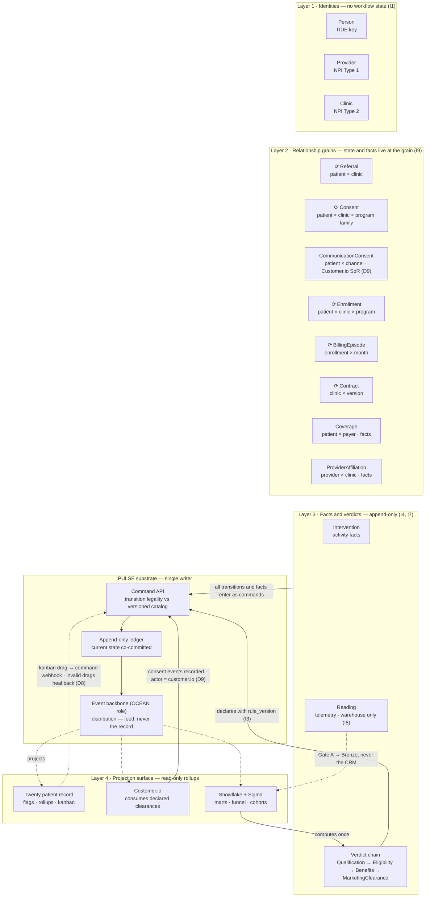

# RPC Object Model — Options Assessment and Recommended Catalog

**Status:** Draft v0.7 — register resolved (D4 open, confirmations pending per §8.1), billing invariants closed, ready for PRD fold | **Deciders:** Ford (author), Tal (sign-off), Ethan (D1, D6), Oren (D11), Luke (D12), Marketing (D10, D13)
**Scope:** Conceptual object model for Brook's remote patient care (RPC) platform, implemented as Twenty CRM objects projected from the PULSE ledger, with FHIR appearing only at the inbound conformance gate and outbound publication.
**Revision:** v0.7 (2026-07-31) — month-grain exclusivity and verdict re-run semantics added to BillingEpisode, register provenance annotated (§8.1). Change log at end.

---

## 0. TL;DR

Three paradigms are viable: the Salesforce-shaped CRM overlay (the original sketch), a full party–role master data management (MDM) model, and an episode-centric spine on a thin identity layer. The sketch fails the two tests Brook cares most about: identity integrity (Lead conversion mutates identity, which breaks TIDE) and multi-program concurrency (a status field on a person cannot hold Chronic Care Management (CCM) and Remote Physiologic Monitoring (RPM) at once). Full party–role is the opposite failure: correct and unusable, because care teams work patients, not role abstractions.

**Recommendation: Option 3, the episode-centric spine.** Admission to the catalog is governed by grain, not paradigm (invariant I9): identity objects carry no workflow state, and relationship grains — Referral, Coverage, Consent, CommunicationConsent, Enrollment, BillingEpisode, Contract, ProviderAffiliation — carry the facts and state that exist at their grain and nowhere else. Programs are configuration rows, not schema. Computed verdicts (qualification, eligibility, benefits, marketing clearance, billability) are calculated once in the warehouse and committed back to the ledger as attributed transitions — "derived-then-declared" — never inferred at read time. A four-verdict chain (Qualification → Eligibility → BenefitsVerification → MarketingClearance) absorbs Marketing's entire 24-row must-report funnel with **zero new states**: every sheet row lands as a verdict, a fact, or a join.

The original sketch was missing Consent, Coverage, and Program. This revision adds the verdict-chain objects, PanelSnapshot for manual denominators, and CommunicationConsent (Customer.io as system of record, ledger-recorded per D9), and reserves CareBarrier. Prior art from Salesforce Health Cloud (SFHC) is audited in §4.4: its Care Program layer independently validates this spine, and its Clinical Data Model is rejected deliberately as the direct-FHIR-modeling anti-pattern. The decision register is merged (§8): D1–D4 preserved from the 2026-07-30 Twenty-objects register, D5–D8 renumbered from this assessment's v0.1, D9–D13 new from this pass. As of v0.7, every item is resolved except D4, which is reworded in §8 for decidability — with resolution provenance tracked in §8.1, where owner confirmations are explicit receipts rather than implied. Appendix A maps all Marketing sheet rows and registers ten gaps in the sheet itself.

---

## 1. Goal and inherited constraints

Design an industry-leading object model for remote patient care that:

- Inherits FHIR's datatypes, rejects its resource boundaries and optionality
- Derives business objects from Brook's own state machines, surfaced through Twenty CRM
- Constrains value objects to be mechanically projectable
- Publishes the domain↔FHIR mapping as a real profile artifact validated in continuous integration (CI)
- Confines FHIR to exactly two points in the stack: inbound at Gate A, outbound at publication

These prior decisions are treated as locked: PULSE (Patient Unified Ledger of State and Events) command API with a single-writer rule over an append-only ledger, Twenty as a projection consumer with one attributed MCP write path, billability computed exclusively in the warehouse with Twenty consuming flags only, FHIR R4 as the Bronze contract with conversion at the edge, and synthetic Synthea data until the C1 gate (executed Snowflake Postgres BAA) clears.

**Pinned vocabulary (mirrored in the §8 register).**
*PULSE* — the PRM-scoped declared-state ledger and its command API. The book of record for patient-relationship state: transactional, single-writer, transition legality enforced at write time against the versioned catalog, current state co-committed with each event.
*OCEAN* — the platform-level event architecture framing (event backbone + operational data graph). The backbone role is *distribution*: the EventBridge relay and archive, at-least-once, replayable, many consumers, never authoritative. PULSE amends OCEAN's "state is derived in the graph" doctrine for patient state specifically — transitions are declared into the ledger, then distributed on the backbone. Record versus feed.

### Design invariants (I1–I9)

These are the rules every object in §5 satisfies. They are the model's answer to "what makes this industry-leading" — most vendor models violate at least three of them.

- **I1 — Identity carries no workflow state.** A Person has facts (demographics, identifiers, a deceased date). A Person is never "active," "enrolled," "marketable," or "churned." Status always belongs to a scoped object. The current funnel fragility traces directly to violating this: "patient status" is unanswerable without asking "status *in what*."
- **I2 — Every status has exactly one home object and one grain.** If two objects can disagree about a status, the model is wrong.
- **I3 — Two species of state, both declared.** *Declared transitions* enter through the PULSE command API from an attributed human or system actor. *Derived verdicts* (qualification, eligibility, benefits, billability, transmission compliance) are computed in exactly one place — the warehouse computation authority (dbt, per D1) — then committed to the ledger as transitions whose actor is the model version, with input lineage. Consumers read the ledger. Nothing re-derives a verdict at read time. This resolves the apparent tension between "declared, not inferred" and "billability computed in dbt": inference is permitted when its output is declared with provenance. The anti-pattern was never computation — it was scattered, unattributed, read-time reconstruction.
- **I4 — Reasons are coded facts, counters are facts, neither are states.** State machines stay coarse. "Third outreach attempt" is an Intervention record, not a state. "Disenrolled" is one state with a mandatory reason CodeableConcept, not eight terminal states.
- **I5 — Value objects use FHIR datatypes.** Identifier {system, value}, CodeableConcept {system, code, display}, Period, Quantity with UCUM units, Money, typed references. This is what makes projection mechanical.
- **I6 — Programs are configuration, not schema.** Adding Advanced Primary Care Management (APCM) Level 2, Principal Care Management (PCM), or a future Behavioral Health Integration program means new Program rows, new catalog entries, and new rule versions. Zero migrations. Program config also carries the CMS exclusivity group that prevents same-month conflicting enrollments at command time.
- **I7 — Correction by reversal.** Time entries and activity facts are append-only. A mistake is voided by a reversal event, never edited. This is the audit posture CMS reviews expect.
- **I8 — Telemetry never enters the CRM.** Device readings are warehouse-only Observations. Twenty sees verdict flags (reading_days_this_period), never streams.
- **I9 — Admission by grain, not by paradigm.** An object enters the catalog if and only if it is (a) an identity with independent existence, (b) a relationship grain carrying facts or state that have no other single home, or (c) a fact, verdict, config, or mirror per the §3 kind taxonomy. Nothing enters because a paradigm has it. Nothing is excluded because a paradigm owns it.

---

## 2. Autopsy of the Salesforce sketch

The sketch (Contact=Patient, Lead=Referral, Contact2=Provider, Account=Clinic, Case=Zendesk, plus net-new Enrollment, Billing Episode, Contract, Intervention) got the net-new list mostly right and the standard-object mapping mostly wrong. Specifically:

**What survives:** Account=Clinic and the four net-new objects. The instinct that Enrollment and Billing Episode are first-class was correct and is the core of the recommended model.

**What breaks:**

1. **Lead→Contact conversion is identity mutation.** In Sales Cloud, conversion destroys the Lead and mints a Contact. A Brook referral is different in kind: it references a patient who may already exist in the system under a different clinic's MRN. Referral handling is identity *resolution* against the TIDE key, never identity creation-by-conversion. Modeling Referral as Lead guarantees duplicate identities — the exact failure TIDE exists to prevent.
2. **Status-on-Contact cannot hold concurrency.** A patient simultaneously active in CCM at Clinic A and pending RPM device activation is one person with two enrollment states. Any per-person status field forces the enrichment-as-record inference this whole program exists to kill.
3. **Contact2=Provider is a record-type workaround for a platform that has record types. Twenty does not.** Providers and patients share almost no fields, and mixing them in one People object puts National Provider Identifier (NPI) records inside PHI-bearing patient views — a needless access-control hazard.
4. **The sketch has no Consent, Coverage, or Program.** Consent is the single most audited artifact in CCM/APCM programs (method, date, obtained-by, revocation). Coverage determines program tiering (chronic condition count plus Qualified Medicare Beneficiary (QMB) status) and copay exposure, which is the leading disenrollment driver. Program is what keeps the model from ossifying around today's CPT codes.

Prior art bearing on this diagnosis — including how Salesforce's own healthcare product abandoned the Sales Cloud shape — is audited against the catalog in §4.4.

---

## 3. Two classification axes

Every object in the catalog is classified on two axes. The first axis (FHIR bucket A/B/C) was established previously. The second axis is new and does more work:

| Kind | Definition | State home | Write path |
|---|---|---|---|
| **Registry** | Identity and reference data. Facts with effective periods, no workflow | None (facts only) | Command API (identity ops) or config deploy |
| **State-bearing** | Owns a declared state machine | PULSE subject | Command API transitions |
| **Activity fact** | Immutable record of something performed | Append-only, void-by-reversal | Command API append |
| **Derived verdict** | Output of centralized computation, committed to the ledger | Verdict events, by computation actor | Warehouse → ledger (I3) |
| **External mirror** | Another system's object, projected read-only | Owned elsewhere | Sync job, read-only |

The kind determines everything downstream: whether the object is a PULSE subject, whether Twenty can trigger writes against it, what its FHIR projection looks like, and what its test obligations are.

Two rules govern the derived-verdict kind:

**The subprocess rule.** Departmental gate outcomes are verdicts or facts on their governing grain — never Person attributes, never spine states. Mint a verdict object only per distinct (authority, grain, cadence) triple. Otherwise the gate is a criterion inside an existing verdict, or a fact on an existing object, joined at evaluation time. This is what keeps "Marketable," "BI complete," and "provider participates" off the Patient record and out of the state machines.

**Trinary outcomes.** Evaluability is separate from judgment. Gates A/B decide whether a record is well-formed and complete enough to judge. Rules decide the verdict. A record that fails Gate B yields `indeterminate(insufficient_data)`, never a negative verdict. Unknown and no are different funnel facts, and conflating them is how eligible patients silently vanish from counts.

---

## 4. Options assessment

### 4.1 The options

- **Option 1 — CRM-native overlay.** The sketch as drawn. Standard objects carry patient status, Lead conversion models the funnel, custom objects bolt on.
- **Option 2 — Full party–role MDM.** Person entities hold identity, PersonRole objects (patient-at-clinic, provider-at-clinic, caregiver-of-patient) carry state, relationships are first-class. The enterprise MDM textbook answer.
- **Option 3 — Episode-centric spine on thin identity.** Registry identities carry zero workflow state (I1). Relationship grains carry the state and facts (I9). Activities are append-only facts. Care-team ergonomics come from computed rollups projected onto the patient record. The spine is drawn in §4.3, with a regeneration prompt in Appendix B.

A fourth candidate — "objects are pure ledger projections" — is not an option but the substrate. All three options sit on PULSE. The question this document answers is what *shape* the projected objects take, which is the same question as "what is the ledger's subject taxonomy."

### 4.2 Assessment matrix

| Dimension | Opt 1: CRM overlay | Opt 2: Party–role MDM | Opt 3: Episode spine |
|---|---|---|---|
| TIDE identity integrity | ✗ Lead conversion mutates identity | ✓✓ Identity fully isolated | ✓ Thin identity, resolution not conversion |
| Declared-state fit (I1, I2) | ✗ Status scattered on persons | ✓ Roles hold state, some role/enrollment duplication risk | ✓✓ One home per status, one grain each |
| Billing physics (patient-month unit) | △ Billing Episode bolted on without grain definition | △ Still needs the episode unit invented | ✓✓ BillingEpisode = enrollment × calendar month, native |
| Multi-program concurrency | ✗ One status field per person | ✓ Roles support it | ✓ One Enrollment per program, exclusivity enforced at command time |
| Program extensibility (I6) | ✗ New program = new fields and views | △ Roles orthogonal to programs, config still needed | ✓ Program rows + catalog entries + rule versions |
| FHIR projectability | △ Patient maps, funnel objects do not | ✓ Mirrors Person/Patient/PractitionerRole | ✓ EpisodeOfCare-shaped with documented loss, identities bucket A |
| Twenty ergonomics | ✓ Native, fastest to stand up | ✗ Indirection hostile to care-team UI, Twenty lacks record-type polymorphism to soften it | ✓ Person-centric views via projected rollups, kanban on spine objects |
| Funnel and cohort derivability | ✗ Counts re-derived from field history — the current failure mode | △ Derivable with joins across roles | ✓✓ Cohort = enrollments by start month, funnel = ledger + verdict chain, direct reads |
| Migration and build cost | ✓ now / ✗ later | ✗ Highest abstraction cost, hardest POCAR mapping | △ More objects than sketch, each simple |

### 4.3 Verdict

**Option 3.** An earlier draft of this section framed one object as "borrowed from Option 2." That framing is withdrawn — it made paradigm membership look like an admission criterion, which it never was. The criterion is I9, and under I9 the spine reads as follows: three registry anchors (Person, Provider, Clinic) that carry no workflow state, and a set of relationship grains, each admitted because facts or state exist at that grain with no other single home.

| Relationship grain | Carries |
|---|---|
| Referral (patient × clinic) | Pre-enrollment funnel state machine, intake provenance |
| Coverage (patient × payer) | Plan, period, QMB status |
| Consent (patient × clinic × program family) | Grant lifecycle, method, evidence |
| CommunicationConsent (patient × channel) | Channel opt-in, recorded from Customer.io (D9) |
| Enrollment (patient × clinic × program) | The primary state machine |
| BillingEpisode (enrollment × month) | Billing verdicts, accruals |
| Contract (clinic × version) | Terms, economics model |
| ProviderAffiliation (provider × clinic) | Effective period, participation, attribution context, outreach approval, roster provenance |

ProviderAffiliation is not an exception imported from another paradigm — it is the provider-side instance of the same rule that admits Coverage on the patient side. The object is forced by the data, not by doctrine: a `clinic` foreign key on Provider is factually wrong (providers practice at multiple client clinics), duplicate Provider rows per clinic splinter the NPI and one-identity-per-human, denormalizing the facts onto Enrollment turns "which providers are active at clinic X" into inference over side effects, and a bare many-to-many link carries no fields. Facts at the provider × clinic grain need a home, so I9 admits one. Both identities stay thin. One rule, no exceptions.

Roles materialize as objects only where role-scoped facts exist. Patients need no role object because the patient-at-clinic role has no facts that are not already Referral or Enrollment facts. For patients, **the enrollment is the role.** Collapsing that indirection is what keeps Option 3 usable where Option 2 is not.

#### The spine, drawn



Legend: solid arrows are declared writes through the command API, dashed arrows are projections and reads, ⟳ marks a PULSE subject that owns a state machine. CommunicationConsent carries no badge — Customer.io adjudicates it and the ledger records it (D9). Elided for legibility: Program (config), PanelSnapshot (denominator fact), Device (state-bearing, v1 per D7), ExternalIdentifier (mechanism), Case (mirror), CareBarrier (reserved). FHIR is deliberately absent — it exists only at the inbound gate and outbound publication, both out of frame. The regeneration prompt for this diagram, including a simplified slide variant, is Appendix B.

### 4.4 Prior-art audit: Salesforce Health Cloud

SFHC is two models wearing one product name, and the split lands exactly on the line this document draws.

**Layer 1 — Care Program Management.** CareProgram (a set of activities offered to participants — therapy, education, wellness, financial assistance) with CareProgramEnrollee as the patient × program junction carrying enrollment status, plus goal, team member, and campaign objects. This is the Program/Enrollment spine, independently validated at Salesforce's scale.

**Layer 2 — the Clinical Data Model.** Explicitly built to align with FHIR R4 on core platform objects (CareObservation, HealthCondition, MedicationRequest, DiagnosticSummary). This is the direct-modeling anti-pattern, and it is *rational for them*: a horizontal platform serving payers, providers, pharma, and medtech must be a lowest-common-denominator clinical store for arbitrary tenants. Brook's clinical store is Bronze/Silver in Snowflake. Copying this layer into Twenty would put FHIR in the middle of the stack and break the exactly-twice constraint.

The portability argument settles the conformance question. Salesforce's own developer documentation concedes that its FHIR R4 implementation is not identical to HL7's definition, and publishes mapping documentation showing how FHIR resources map to its objects (for example, Observation maps to CareObservation plus CareObservationComponent). SFHC's interchange surface is therefore FHIR reached through documentation-grade mappings. Brook's is FHIR reached through CI-validated profiles (§7). Any future coexistence or migration routes through FHIR transitively. Conforming Twenty to SFHC names would couple Brook to a proprietary schema without buying an interface — and the Brook mapping artifact is the mechanically stronger version of theirs.

| SFHC construct | Brook catalog answer | Verdict |
|---|---|---|
| CareProgram / CareProgramEnrollee | Program / Enrollment (Brook adds clinic to the grain + exclusivity groups) | Convergent ✓ |
| HealthcarePractitionerFacility junction | ProviderAffiliation | Convergent — triple convergence with FHIR PractitionerRole ✓ |
| Identifier + CodeSet as first-class tables | ExternalIdentifier + state catalog | Convergent — validates the mechanism ✓ |
| MemberPlan vs CoverageBenefit split (benefits verification model) | Coverage (fact) + BenefitsVerification (verdict) | **Adopted** — active, row 19, Billy as current runner |
| ContactPointConsent family (channel-level consent) | CommunicationConsent | **Adopted** — row 11; Customer.io is system of record, ledger-recorded (D9) |
| CareBarrierType + CareIntervention (SDOH barriers and remediation) | CareBarrier | **Reserved** — row 22, Gravity SDOH mapping at build |
| Clinical Data Model (FHIR resources as tables) | Bronze/Silver warehouse | **Rejected deliberately** — direct-modeling anti-pattern, rational only for a horizontal platform |
| Utilization Management (preauth, admissions, appeals) | — | Rejected — payer-side business |
| CareProgramProduct / commerce attachments | — | Rejected — programs are not SKUs here |
| CarePlan / ActionPlan / Assessment | `care_plan_reviewed` Intervention type | Deferred, unchanged |

Sources: Salesforce Health Cloud developer guide, data model documentation, and FHIR R4 mapping reference (developer.salesforce.com, retrieved 2026-07-30).

---

## 5. Recommended object catalog

### 5.1 Catalog

| # | Object | Kind | Grain (identity rule) | PULSE subject | FHIR bucket → target | Twenty surface |
|---|---|---|---|---|---|---|
| 1 | Person (Patient) | Registry | One per human, TIDE key | Facts only | A → Patient (US Core-derived profile) | People (standard) |
| 2 | ExternalIdentifier | Registry (child) | (system, value) → Person | No | Identifier datatype | Custom child object |
| 3 | Provider | Registry | One per human, NPI Type 1 at person level | No | A → Practitioner | Custom object (net-new — D2 resolved) |
| 4 | ProviderAffiliation | Registry | Provider × Clinic, effective period | Facts only | A → PractitionerRole (via mapping, §7) | Custom object |
| 5 | Clinic | Registry + light lifecycle | One per client org, NPI Type 2 | Onboarding lifecycle | A → Organization | Companies (standard) |
| 6 | Program | Config registry | One per billable program tier | No | C (internal CodeSystem) | Custom object |
| 7 | Coverage | Registry (refreshed) | Patient × payer × period | No | A → Coverage | Custom object (thin), full detail in warehouse |
| 8 | PanelSnapshot | Reference fact | Clinic × as_of × source | No | C | Custom object (denominator record) |
| 9 | Referral | State-bearing | Patient × Clinic, one open at a time (D5) | **Yes** | B → ServiceRequest (low priority) | Custom object, kanban |
| 10 | Consent | State-bearing | Patient × Clinic × program family | **Yes** | B → Consent (narrow profile) | Custom object |
| 11 | CommunicationConsent | State-bearing (externally adjudicated) | Patient × channel | Recorded only — Customer.io is system of record (D9) | C — no outbound need identified | Custom object; ledger records Customer.io consent events |
| 12 | Enrollment | State-bearing | Patient × Clinic × Program | **Yes** | B → EpisodeOfCare (documented loss) | Custom object, kanban |
| 13 | BillingEpisode | State-bearing + verdicts | Enrollment × calendar month | **Yes** | C | Custom object, computed flags only |
| 14 | Device | State-bearing | One per physical unit | **Yes** (D7: in v1) | A → Device | Custom object |
| 15 | Contract | State-bearing | Clinic × terms version | **Yes** | C (do not use FHIR Contract) | Custom object |
| 16 | Intervention | Activity fact | One per performed activity | Append-only | B → Procedure/Communication (outbound only) | Custom object, recent window |
| 17 | QualificationAssessment | Derived verdict | Patient × Program × run | Verdict events | C | Custom child (latest verdict only) |
| 18 | EligibilityAssessment | Derived verdict | Patient × Clinic × Program × run (Referral demoted to provenance ref) | Verdict events | C | Custom child (latest verdict only) |
| 19 | BenefitsVerification | Derived verdict | Patient × Coverage × run | Verdict events | B → CoverageEligibilityResponse (low priority) | Custom child (latest verdict only) |
| 20 | MarketingClearance | Derived verdict | Patient × Clinic | Verdict events | C | Custom child; gates Customer.io projection |
| 21 | Reading | Telemetry fact | Device × timestamp | No — warehouse only (I8) | A → Observation | None (flags on BillingEpisode) |
| 22 | CareBarrier | **Reserved** | Patient × barrier type | — | B → Gravity SDOH (Condition/Observation) | Trigger: SDOH program commitment |
| 23 | Case | External mirror | Zendesk ticket ID | No | C | Custom object mirror |

Six PULSE subject types — Referral, Consent, Enrollment, BillingEpisode, Device, Contract — none build-gated. CommunicationConsent is recorded state: Customer.io adjudicates, the ledger keeps the attributed history (D9). Everything else is facts, verdicts, config, or mirrors. That is the entire state surface of the business, and it is small on purpose. The table's regeneration prompt, including the machine-readable seed format for S0.2, is Appendix C.

### 5.2 State machines

States are coarse per I4. Every transition carries actor, timestamp, and (where marked) a mandatory reason CodeableConcept bound to a catalog ValueSet.

**Referral** — the pre-enrollment funnel object and the direct answer to the CEO's complete-intake-record requirement. One open Referral per patient × clinic (D5, resolved).

```
received → resolved → screened → outreach → converted
                                          → closed(reason)
```

- `received`: feed row or manual intake landed. Raw payload retained in Bronze.
- `resolved`: identity resolution complete — matched to an existing Person or minted a new TIDE key, ExternalIdentifier attached. Resolution is a command with the matcher's evidence as provenance.
- `screened`: QualificationAssessment and EligibilityAssessment verdicts exist for every program active at the clinic (trinary — `indeterminate` rows stay countable, per §3).
- `outreach`: at least one program eligible and clearances in place. Attempts are Intervention facts, never states.
- `converted` (terminal): first Enrollment spawned. One Referral can spawn multiple Enrollments.
- `closed` (terminal): reason ∈ {no_eligible_program, unreachable_per_policy, declined, duplicate, deceased, clinic_terminated}.

**Consent** — per patient × clinic × program family. Facts: method (verbal | written), obtained_by, consent_language_version, evidence_ref (call recording or document pointer).

```
requested → granted → revoked | superseded | expired
```

**CommunicationConsent** — per patient × channel (SMS, email, voice). **Customer.io is the system of record (D9, resolved).** Opt-in and opt-out originate in channel interactions — patients reply STOP, click unsubscribe, confirm opt-in — and Customer.io, with the carriers behind it, adjudicates suppression at send time. The ledger does not own this state machine and never blocks a suppression. It records every transition as a declared event with actor = customer.io and message-level provenance, so audit history and funnel reads come from the ledger while adjudication stays at the channel boundary. The v0.2 authority-transfer gate is dissolved: recording starts when the ingress lands, and there is no empty-ledger hazard because the design is ledger-records-external-state, not ledger-owns-state. A periodic reconciliation sweep (the warehouse-as-referee pattern) compares ledger history against Customer.io's suppression export and declares corrections with actor = reconciliation.

```
unset → opted_in ⇄ opted_out      (shape of the recorded state)
```

Facts: method (web_form | verbal | keyword), source system, evidence_ref. Compliance posture (§9): the compliance owner validates Customer.io's carrier-STOP configuration as authoritative rather than ledger semantics.

**Enrollment** — the primary aggregate. One per patient × clinic × program.

```
pending_start → active ⇄ on_hold
             → ended(reason)     [from any non-terminal state]
```

- `pending_start`: consent granted, program entry gate not yet met. The gate is Program config: CCM requires an initiating visit, RPM requires device activation, APCM requires attribution confirmation.
- `active`: service delivery underway. The `pending_start → active` transition is pinned as Marketing's "Activated" metric (D10, resolved).
- `on_hold`: reason ∈ {hospitalized, patient_request, provider_hold, travel}. Hold months still open BillingEpisodes (some programs bill through holds — a rule concern, not a model concern).
- `ended` (terminal): reason ∈ {consent_revoked, deceased, patient_choice, copay_burden, moved, graduated, program_switch, clinic_offboarded}. The command API enforces Program exclusivity groups here and at activation: no two active Enrollments in the same exclusivity group per patient. **This check operates at the enrollment grain and prevents concurrency only — it cannot see same-month billing conflict.** A CCM enrollment ended June 15 followed by a PCM activation June 16 passes it cleanly while leaving two same-group BillingEpisodes open for June. The month-grain half of the invariant is enforced by the BillingEpisode qualification verdict (below). One invariant, two homes, both declared. (CMS same-month rule text confirmed by the billing team — mechanism belongs in the model regardless.)

**BillingEpisode** — the billing unit. One per Enrollment × calendar month, opened by the ledger at month start for every active or on-hold Enrollment.

```
open → qualified ⇄ not_qualified → reported → closed
                                            [billed → reconciled reserved behind config — D6 resolved]
```

- `qualified` / `not_qualified` are **verdict states** (I3): the warehouse evaluates program rules (CCM time thresholds, RPM reading-day plus interactive-time requirements, APCM monthly tiering) and commits the verdict to the ledger with rule_version and input lineage. Twenty displays the flag. Nothing downstream recomputes it.
- **Verdicts are re-runnable until `reported`.** Facts accumulate through the month — an episode declared `not_qualified` on June 20 can legitimately cross the CCM time threshold on June 28. The catalog therefore makes `qualified ⇄ not_qualified` legal transitions, actor = the verdict runner, each re-run declared with a fresh rule_version and as_of and full input lineage. Without this, transition-legality enforcement (§1 pinned vocabulary) rejects the model's own verdict runner — the machine as previously drawn was not closed under I3's re-evaluation. `reported` freezes the verdict: post-report corrections go through reversal (I7), never re-verdict.
- **Month-grain exclusivity lives here, not on Enrollment.** The qualification verdict enforces: at most one episode per patient × exclusivity group × calendar month may hold `qualified`. Mid-month program switches (the June CCM→PCM case above) open two same-group episodes for the month, and the verdict rules adjudicate which — if either — qualifies, per rule_version. Conflict adjudication is a verdict, so it is computed once, declared with lineage, and reproducible as-of any date (I3). The mid-month-switch conflict is a mandatory rule_version regression fixture (§7 test obligations).
- `reported`: billing-ready episode delivered to the clinic. D6 resolved: the v1 lifecycle ends here, with `billed → reconciled` reserved behind config until a percent_of_collections contract triggers claim-outcome ingestion.
- Facts on the episode: accrued_minutes (Quantity, UCUM `min`), activity_count, reading_days, rule_version.

**Device** (in v1 scope — D7 resolved):

```
ordered → shipped → delivered → active → returned | lost
```

"Transmitting" and "lapsed" are deliberately not states — they are time-window verdicts (reading_days on the BillingEpisode). Putting them on the device would violate I3 and generate transition noise. Marketing's rows 21–23 are derived views over these states (Appendix A).

**Contract:**

```
draft → active → superseded | terminated
```

Terms are a versioned child: program pricing, the economics model (per_enrolled_pmpm | percent_of_collections | hybrid), partner outreach approval, campaign restrictions, copay caps. The economics model is what D6 hinges on. Contract terms are the policy source for EligibilityAssessment criteria and MarketingClearance rules (D13).

**Clinic** (light): `onboarding → live → offboarded`. The prospect lifecycle stays in HubSpot, which remains the clinic-side BD system. Handoff to Twenty occurs at contract signature — one boundary, no dual-mastering.

### 5.3 Identity mechanics

- Person carries the TIDE key as its primary identity and an ExternalIdentifier collection as children: `{system: "https://brook.ai/id/mrn/{clinic-ehr-slug}", value, period, use}`. Every source system's key becomes a row, which is exactly FHIR's `Identifier[]` and projects without transformation.
- NPI placement follows NPI type: Type 1 (individual) NPIs are ExternalIdentifiers on Provider with system `http://hl7.org/fhir/sid/us-npi`. Type 2 (organizational) NPIs live on Clinic under the same system. The affiliation between them is ProviderAffiliation, never a foreign key on either identity.
- Uniqueness on (system, value) is enforced in the PULSE command API at resolution time, not in Twenty. Twenty is a projection and holds no constraints of record.
- Deceased is a fact with a date, not a state (I1). It closes downstream objects through commands (Referral → closed(deceased), Enrollments → ended(deceased)) issued by the resolution service, each with provenance.
- Merges are commands: `merge_person(survivor, duplicate, evidence)` re-points identifiers and children in the ledger. Append-only history means merges are auditable and reversible-by-reversal.

### 5.4 Field sketches for the two hardest objects

**Enrollment:** patient (relation), clinic (relation), program (relation), status (SELECT, catalog-generated), status_reason (SELECT, catalog-generated), consent (relation), period_start / period_end (dates from ledger Period), referral (relation, provenance), attributed_affiliation (relation → ProviderAffiliation), hold_reason (SELECT), computed rollups projected from warehouse: months_active, last_qualified_month, engagement_flag.

**BillingEpisode:** enrollment (relation), month (date, first-of-month), status (SELECT), qualification_verdict (SELECT: qualified | not_qualified | indeterminate | pending — trinary per §3, `pending` = not yet run, `indeterminate` = ran but unevaluable), rule_version (text), accrued_minutes (number), reading_days (number), reported_at (datetime). Verdict fields reflect the latest declared run and are written only by the projection path. No human edits.

### 5.5 The verdict chain

Marketing's funnel (Appendix A) decomposes into four verdict objects plus joins, ordered by governing authority. Each verdict is computed once, committed per I3 with rule_version, as_of, and input lineage, and carries trinary outcomes per §3.

| Verdict | Authority | Grain | What it answers |
|---|---|---|---|
| QualificationAssessment | Program rules (clinic-independent) | patient × program × run | Age, qualifying diagnosis, payer covers the service type. A patient qualified for CCM is qualified everywhere |
| EligibilityAssessment | Partner policy (Contract-scoped) | patient × clinic × program × run | Plan acceptance, service lines, diagnosis carve-outs, clinical thresholds (A1c, uncontrolled HTN), estimated copay within cap |
| BenefitsVerification | Payer, via Billy today | patient × coverage × run | Verified benefits and copay, QMB status. Billy's manual process is the current verdict runner — rule_version distinguishes manual runs from automated 270/271 when that integration lands |
| MarketingClearance | Explicit opt-in, computed from ledger-recorded CommunicationConsent (D13) | patient × clinic | Marketability = explicit opt-in via Customer.io. Partner campaign restrictions extend the rule through rule_version if contracted. The verdict still gates campaign sends as a declared clearance |

Joined at evaluation time, not duplicated into verdicts: ProviderAffiliation.participating (within period), Contract partner-outreach term, ProviderAffiliation.outreach_approved. Funnel counts are point-in-time conjunctions over latest verdicts plus joins, reproducible as-of any date. The canonical criteria evaluation order — which criterion gets credited for a removal in waterfall views — is pinned in rule_version (D12), because unordered conjunctions let two analysts produce two waterfalls from identical data.

Eligibility is re-runnable by design: the grain change from v0.1 (referral × program → patient × clinic × program, referral as provenance) exists because insurance and clinical values change after conversion, and eligibility must be re-evaluated post-enrollment without a referral to hang it on.

---

## 6. Twenty implementation notes

1. **Standard objects for identity, custom objects for everything else.** Patient → People and Clinic → Companies keeps Twenty's email/calendar sync surface (which only operates on standard objects) attached to the records where communication actually happens. Provider gets its own custom object — field sets diverge completely from patients, and separating them keeps NPI directory data out of PHI-scoped patient views.
2. **SELECT options are generated, never hand-edited.** Every status and reason SELECT in Twenty is emitted from the state catalog (§7). Twenty's Metadata API makes this a deploy step, and the existing codegen precedent in the Twenty ecosystem (TypeScript-definition-to-metadata scaffolding) confirms the pattern is supported, not fought.
3. **Kanban drag is a command, not an edit (D8, resolved).** Care teams will drag Referral and Enrollment cards between columns — that is the entire ergonomic appeal. Approved pattern: a Twenty workflow on record-update fires a webhook to the PULSE command API, which validates the transition against the catalog. Valid transitions commit to the ledger and the projection confirms. Invalid transitions are healed — the projection writes the card back to its true column within seconds and attaches a comment stating the rejected transition and reason. Optimistic UI, authoritative ledger, single-writer preserved because the ledger write only ever happens through the command API.
4. **Relations, not foreign-key strings.** Twenty relation fields (one-to-many, many-to-many) carry all references in §5.1. Typed references per I5.
5. **The MCP write path stays singular.** Twenty 2.0 ships a native MCP server, which is convenient for read tooling but does not change the write architecture: the one attributed write path co-located in Snowpark Container Services (SPCS) remains the only projection writer. Verify current Twenty capability details during S-phase — the platform ships fast and this document's Twenty claims should be re-checked against the release notes at build time.

---

## 7. FHIR projection plan and the catalog as generative contract

### Projection targets

Bucket assignments are in the §5.1 table. Notes on the non-obvious ones:

- **Enrollment → EpisodeOfCare (B):** documented loss includes program tier semantics, exclusivity groups, and hold reasons (extensions in the Brook implementation guide). Round-trip is not a goal for bucket B — outbound fidelity of period, status, managing organization, and care manager is.
- **ProviderAffiliation → PractitionerRole (A):** the domain name differs from the FHIR name by design. The translation is one declaration in the mapping artifact and costs nothing at runtime — which is precisely why domain names never need to chase FHIR names (see the logical-model mechanism below).
- **BenefitsVerification → CoverageEligibilityResponse (B, low priority):** FHIR's native analog of a 271 response. Projected only if a payer-facing exchange ever requires it.
- **Consent → Consent (B):** FHIR Consent is notoriously broad. Profile a narrow subset: scope=treatment, category=program-participation, verification method, period, and provision for the program family. Nothing else.
- **Contract → C:** FHIR's Contract resource targets legal/consent instruments and is a known tar pit. Brook's commercial contract never crosses an interoperability boundary. Keep it native.
- **Intervention → Procedure/Communication (B, outbound only):** projected only if and when clinical summaries are published to an EHR. Internally these are ledger facts.
- **Reading → Observation (A, warehouse only):** conformant at ingestion via Gate A, never surfaced in the CRM.

### Logical models and the mapping mechanism

The domain model is authored in FHIR tooling without becoming FHIR. Three artifacts, three jobs:

1. **Logical models** (`StructureDefinition` with `kind = logical`) define Brook shapes in Brook vocabulary — `BrookProviderAffiliation`, `BrookEnrollment` — with elements typed as FHIR datatypes, which I5 makes nearly free. Domain fixtures validate against logical models in the same HAPI pipeline that validates wire output.
2. **Profiles** (US Core-derived where applicable) define the wire shapes for bucket A/B objects.
3. **Mappings** connect them by three mechanisms, only one of which executes:
   - Element `Mapping` entities — documentation-grade, rendered in the implementation guide, reviewed by humans.
   - **ConceptMaps — the load-bearing artifact.** Generated from the state catalog, they translate Brook codes to bound FHIR codes, and R4's `equivalence` codes (`equivalent`, `wider`, `narrower`, `inexact`, `unmatched`) make documented lossiness *machine-readable*. Example: Enrollment `ended` → EpisodeOfCare `finished` with `equivalence = narrower` and a comment noting the reason code carries what the target drops. (R5 renames `equivalence` to `relationship` — irrelevant while locked to R4, noted for the R6 horizon.)
   - StructureMap and the FHIR Mapping Language (FML) — **evaluated and rejected as an execution engine.** FML is a second transform runtime with thin tooling, on the same grounds that ruled out Great Expectations as a second validation runtime. Transforms remain code. ConceptMaps load into that code as translation tables — executable in the safe, boring way, as data rather than engine.

### One catalog, four generated surfaces

The state catalog (already scoped as S0.2 machinery) is the single generative artifact. Each versioned catalog release emits:

1. **Twenty metadata** — objects, SELECT options, and relation definitions deployed via Metadata API
2. **FHIR Shorthand (FSH)** — logical models for domain shapes, ValueSets for every status and reason set, profiles for bucket A/B objects, Mapping entities, and ConceptMaps — compiled by SUSHI, validated by the HAPI validator against golden fixtures
3. **Warehouse seeds and tests** — accepted_values tests binding warehouse models to the same enumerations
4. **Command API types** — the transition schema the PULSE service enforces

CI fails on drift between any surface and the catalog version, and additionally enforces **ConceptMap completeness**: every catalog code has a mapping row or an explicit `unmatched` entry with rationale. Lossiness stops being prose and becomes a failing test. This gives Luke's cut-by dimensions a single authoritative source: reason codes and program config in the catalog are the dimension vocabulary, defined once.

Test obligations per kind: bucket A objects get round-trip property tests (domain → FHIR → domain invariance). Bucket B objects get explicit lossiness assertions via their ConceptMap equivalence codes. Verdict objects get rule_version regression fixtures. Unmapped terminology routes to the quarantine review queue, consistent with the P1 pipeline's Gate B posture.

---

## 8. Decision register (merged snapshot)

The register of record is Linear. Writes are queued behind connector approval configuration — until they land, this table is authoritative. IDs D1–D4 are preserved verbatim from the 2026-07-30 Twenty-objects register, which shipped to a Product audience and does not change. This assessment's v0.1 decisions are renumbered D5–D8.

| ID | Decision | Status | Owner | Provenance |
|---|---|---|---|---|
| D1 | Do colleagues' YAML rulesets execute outside the warehouse authority? Touches I3's "computed in exactly one place" | **Resolved (07-31):** No. Rulesets execute inside the warehouse authority. I3 finalized | Tal + Ethan | Twenty-objects register |
| D2 | Provider: net-new object vs view on Person. Catalog row 3 stance (net-new) was the recommendation input | **Resolved (07-31):** Net-new object, as recommended. Row 3 annotation lifted | Tal | Twenty-objects register |
| D3 | Permission tiers enforced by the self-hosted deployment | **Resolved (07-31):** Approved per the Twenty-objects thread recommendation | Ford | Twenty-objects register |
| D4 | **Reworded for decidability** (original phrasing stands in the Twenty-objects register): must the catalog→Twenty metadata generator emit a reviewable *artifact* — the serialized set of Metadata API operations — that CI builds and validates, with a separate deploy step applying it to an instance (build ≠ publish)? "Portable" meant instance-independent: the same artifact promotes dev → staging → prod. The contrast is not portable vs fixed — it is artifact-emitting vs live-apply, where the CLI connects to a running Twenty instance and mutates it in one fused step. Recommendation: require the split — it is the change-control posture HIPAA/SOC2 review expects and the same shape as every other generated surface in §7. If the community scaffolding CLI cannot emit an artifact, the S0.2 Twenty-metadata generator emits its own; the generator is ours anyway | Open — awaiting yes/no now that terms are defined | Ford | Twenty-objects register |
| D5 | Referral grain | **Resolved, confirmed 07-31:** patient × clinic, with per-program verdicts as children — realized as the QualificationAssessment / EligibilityAssessment split (§5.5), superseding v0.1's single-assessment framing | — | v0.1 as D-1 |
| D6 | BillingEpisode terminal boundary: `reported` vs tracked through `billed → reconciled`. Hinges on Contract economics — percent_of_collections mandates claim-outcome ingestion, flat per-enrollee does not | **Resolved (07-31):** Ship `reported`. Downstream states reserved behind config until a percent_of_collections contract triggers claim-outcome ingestion | Ethan + Tal | v0.1 as D-2 |
| D7 | Device + Reading in v1 scope. Marketing's mandatory reporting includes three RPM device stages (sheet rows 21–23), derived views over Device states | **Resolved (07-31):** In v1 scope. Catalog gate lifted | Tal | v0.1 as D-3 |
| D8 | Kanban-drag-as-command with heal-back (§6.3). Touches single-writer doctrine | **Resolved (07-31):** Approved as a sanctioned special case — writes still route through the command API, so the doctrine holds | Tal | v0.1 as D-4 |
| D9 | CommunicationConsent authority | **Resolved (07-31), inverting the v0.2 recommendation:** Customer.io is the system of record — it produces consent state through its communications and adjudicates suppression at send time. The ledger records every transition as an attributed event (actor = customer.io) and never adjudicates. The authority-transfer gate is dissolved. §5.2 rewritten | Tal + compliance owner | This pass |
| D10 | Pin the definition of "Activated" | **Resolved (07-31):** Pinned to the Enrollment `pending_start → active` transition, whose entry gate is per-program config | Marketing + product owner | This pass |
| D11 | Program set confirmation: Marketing's sheet reports PCM/CCM/RPM, v0.1 assumed CCM/APCM | **Resolved (07-31):** APCM added. Program set is PCM, CCM, RPM, APCM | Oren + Tal | This pass |
| D12 | Canonical criteria evaluation order for waterfall attribution, pinned in rule_version — cut-by dimension vocabulary | **Resolved (07-31):** Mechanism approved. Luke authors the canonical order in the first rule_version release | Luke | This pass |
| D13 | MarketingClearance policy source | **Resolved (07-31):** Marketability = explicit opt-in via Customer.io, computed from ledger-recorded CommunicationConsent. Partner campaign restrictions extend the rule via rule_version if contracted | Marketing + Tal | This pass |

Resolutions recorded 2026-07-31 from the register review. Twelve of thirteen closed; only D4 remains open, reworded above so it can be answered in one word.

### 8.1 Resolution provenance

The register's own standard applies to the register: every resolution is a state transition and carries an actor and evidence. All twelve resolutions were recorded by Ford in the 2026-07-31 register review (design-rationale thread: "FHIR/HL7 business object design patterns," this Claude project). That makes Ford the **recording actor**, not the deciding authority — decisions with a named owner other than Ford are *recommendations recorded as resolved* until the owner's confirmation is attached. Confirmation = a thread link, meeting note, or Linear comment. Any row still unconfirmed at the exec session is presented there as "recommended, pending confirmation," and the session itself becomes its receipt.

| ID | Recorded by | Owner confirmation | Receipt |
|---|---|---|---|
| D1 | Ford, register review 07-31 | ☐ Tal · ☐ Ethan | *attach* |
| D2 | Ford, register review 07-31 | ☐ Tal | *attach* |
| D3 | Ford, register review 07-31 | ✓ Ford (self-owned) | register review |
| D5 | Ford, register review 07-31 | ✓ no external owner | register review |
| D6 | Ford, register review 07-31 | ☐ Ethan · ☐ Tal | *attach* |
| D7 | Ford, register review 07-31 | ☐ Tal | *attach* |
| D8 | Ford, register review 07-31 | ☐ Tal | *attach* |
| D9 | Ford, register review 07-31 | ☐ Tal · ☐ compliance owner | *attach* |
| D10 | Ford, register review 07-31 | ☐ Marketing · ☐ product owner | *attach* |
| D11 | Ford, register review 07-31 | ☐ Oren · ☐ Tal | *attach* |
| D12 | Ford, register review 07-31 | ☐ Luke | *attach* |
| D13 | Ford, register review 07-31 | ☐ Marketing · ☐ Tal | *attach* |

When register writes push to Linear, each resolution lands as an issue comment carrying its receipt link, and this table retires in favor of the Linear record.

**Pinned definitions** (mirrored in §1): PULSE = book of record, OCEAN backbone = distribution feed. Record versus feed.

**Follow-on, out of this pass:** the OCEAN architecture paper needs a one-paragraph amendment recording the patient-state carve-out ("declared into the backbone, not derived in the graph"), so platform doctrine and PRM implementation stop silently disagreeing.

---

## 9. Assumptions and non-goals

**Assumptions (flagged for verification):**

- Program set at launch: PCM, CCM, RPM, and APCM (D11, resolved). Specific CPT/HCPCS rule parameters are encoded as rule versions and **verified by Ethan's billing team against the current CMS Physician Fee Schedule**, not by this document.
- Clinics submit claims. Brook produces billing-ready episodes (D6, resolved).
- CommunicationConsent: Customer.io is the system of record (D9). The compliance owner validates Customer.io's carrier-STOP configuration as authoritative — the ledger records transitions with attribution and never adjudicates a suppression. TCPA treatment remains a compliance determination consumed by the model, not made by it.
- Twenty OSS capability set (custom objects, SELECT-grouped kanban, relation fields, Metadata API, workflows, webhooks) as of the current release — re-verify at S-phase per §6.5.
- C1 gate governs: Snowflake Postgres reached GA in February 2026, but production PHI in the Twenty database waits on the executed BAA. Synthetic Synthea data until then.
- Zendesk remains the ticketing system. Case stays a read-only mirror.
- Marketing's metrics sheet (2026-07-30 capture, Appendix A) is treated as the must-report requirement set of record for the funnel layer, subject to the gap resolutions registered there.

**Non-goals for v1:**

- Care plan content model. CCM's care-plan compliance requirement is met by a `care_plan_reviewed` Intervention type carrying a document pointer. A structured CarePlan object is deferred until something consumes its structure.
- Claims lifecycle beyond the D6 boundary.
- Clinic BD pipeline (HubSpot's job, handoff at contract signature).
- Caregiver/RelatedPerson modeling. Real, deferred — the catalog reserves the FHIR target so it lands as an addition, not a rework.
- Any workflow authority in Twenty over verdict fields. Flags are projection-only, permanently.

---

## 10. Next action

The register is resolved except D4, reworded in §8 — answer the build-versus-publish question and it closes. The blocking conditions are gone: fold the §5 catalog and §7 CI contract into `DNA-SPEC-DECLARED-STATE-PRM` as the object-model section, and seed the S0.2 catalog work order from §5.1 via the Appendix C machine-readable variant, so the first generated artifacts (Twenty SELECT metadata, FSH logical models and ValueSets) exist before S1.1 ledger schema lands. Register writes — now carrying twelve resolutions — push to Linear when connector approval clears. Until then, §8 is the snapshot of record.

---

## Appendix A — Marketing funnel mapping

Source: Marketing metrics sheet, captured 2026-07-30. Row numbers per the sheet. Headline: **every row lands on the model with zero new states** — verdicts, facts, and joins only, per I4 and the §3 subprocess rule.

### A.1 Row-by-row disposition

| Row | Metric | Model disposition |
|---|---|---|
| 2 | Total panel size | PanelSnapshot fact (clinic × as_of, source = qbr_manual). Declared denominator with lineage instead of a spreadsheet cell |
| 3 | Opportunity size | PanelSnapshot fact (source = emr_analysis) with criteria snapshot (eligible Dx set, age rule) |
| 4 | POP | Count of Person identities carrying a POP-source ExternalIdentifier |
| 5 | Qualified – age | QualificationAssessment criterion |
| 6 | Qualified – diagnosis | QualificationAssessment criterion, per program (PCM/CCM/RPM) |
| 7 | Qualified – insurance covers service | QualificationAssessment criterion (Coverage supports the program's service type) |
| 8 | Eligible – insurance | EligibilityAssessment criterion (partner plan acceptance) |
| 9 | Eligible – service line | EligibilityAssessment criterion |
| 10 | Eligible – diagnosis | EligibilityAssessment criterion (partner carve-outs, e.g. no CHF) |
| 11 | Eligible – health status | EligibilityAssessment criterion (clinical thresholds: A1c > 9, uncontrolled HTN) |
| 12 | Eligible – provider participating | Join: ProviderAffiliation.participating within effective period. Unanswerable without the affiliation object |
| 13 | Eligible – partner approved outreach | Join: Contract partner-outreach term |
| 14 | Eligible – provider outreach approved | Join: ProviderAffiliation.outreach_approved. Rows 13 and 14 are two authorities, not one stage twice |
| 15 | Eligible – copay in partner range | Split into two verdicts: estimated copay (EligibilityAssessment heuristic, pre-BI) and verified copay (BenefitsVerification). See gap G7 — the sheet's ordering is inverted |
| 16 | ELIGIBLE # | Derived conjunction: latest QualificationAssessment = qualified AND latest EligibilityAssessment = eligible AND joins 12–14 true, as-of date |
| 17 | Pending – BI completion | BenefitsVerification pending or absent for patient × coverage |
| 18 | BI complete | BenefitsVerification verdict exists (latest run) |
| 19 | Marketable | MarketingClearance = cleared |
| 20 | In Campaign | Campaign membership lands as declared facts through the ingress substrate (Customer.io emits, ledger records). Conversion-probability shading = Activation Forecasting Model score arriving as a projection |
| 21 | Awaiting Device Shipment | Derived view: Device = ordered |
| 22 | Awaiting Device Delivery | Derived view: Device = shipped |
| 23 | Awaiting Activation | Derived view: Device = delivered, not yet active |
| 24 | Awaiting Onboarding Call | Derived view: Enrollment = pending_start AND no onboarding_call Intervention fact |
| 25 | Activated | Enrollment transition `pending_start → active` (pinned — D10 resolved) |

### A.2 Gap register — defects in the sheet the model cannot paper over

| # | Gap | Disposition |
|---|---|---|
| G1 | Rows 21–25 have blank definition cells, including Activated — the metric the business is paid on | D10 resolved: Activated pinned to the enrollment transition. Rows 21–24 definitions follow from the A.1 dispositions |
| G2 | No loss accounting: the sheet counts survivors only. Row 20's conversion shading demands denominators the sheet cannot produce | Ledger `closed(reason)` and `ended(reason)` provide declined, unreachable, disenrolled, deceased, device-returned for free |
| G3 | Consent is absent between In Campaign and Activated — the most CMS-audited artifact in these programs is missing from the must-report funnel | Consent `granted` is a hard gate and an existing catalog object. Add the stage |
| G4 | Program dimension collapsed: qualification is per-program (row 6) but every count is patient-level, and rows 21–23 are RPM-only stages in a universal funnel | Per-program funnel views required. Material evidence for D7 |
| G5 | PCM appears, APCM does not — contradicts the prior program-set assumption | D11 resolved: APCM added — program set is PCM, CCM, RPM, APCM |
| G6 | Criteria order is a reporting convention, unpinned. Rows 5–15 read as a waterfall but are a conjunction — unordered, two analysts produce two waterfalls from identical data | D12: canonical first-failing-criterion order, versioned in rule_version (Luke) |
| G7 | Copay ordering inversion: row 15 precedes BI (rows 17–18), but BI determines copay | Two-verdict split (row 15 disposition). Sheet shows both or picks one |
| G8 | No indeterminate bucket: records that cannot be evaluated have nowhere to be counted | Trinary outcomes (§3): `indeterminate(insufficient_data)` is a countable funnel fact distinct from a negative verdict |
| G9 | Manual denominators (rows 2–3) have no modeled home or lineage | PanelSnapshot facts (row 8 of catalog) |
| G10 | Stock vs flow semantics and re-evaluation cadence unpinned — the sheet is a one-way pipe | As-of semantics belong to `DNA-SPEC-COHORT-FUNNEL-REQS`. Re-evaluation follows the keep-in-pool pattern: failing patients stay in-pool flagged with the failing rule, so rule relaxation is a filter change, not re-ingestion |

---

## Appendix B — Spine diagram regeneration prompt

The §4.3 diagram ("The spine, drawn") is one execution of the prompt below. The prompt is the diagram's spec: it encodes the semantic rules a correct rendering must obey, so any tool, colleague, or Claude session can regenerate the visual (or a slide variant) without reading this document. Version it with the catalog — when the catalog changes, this prompt changes.

```text
Draw a layered architecture diagram titled "Option 3 — episode-centric spine on
thin identity" for Brook's remote patient care object model. Audience: product,
engineering, and exec colleagues learning how PULSE-backed objects fit together.
The goal is to cement one idea: identities never carry workflow state — state
lives on relationship grains, verdicts are computed once and declared back, and
every surface is a read-only projection.

Layout: five horizontal bands, top to bottom.

Band 1 — "Identities — no workflow state (I1)": Person (TIDE key), Provider
(NPI Type 1), Clinic (NPI Type 2). Thin boxes, no status fields anywhere.

Band 2 — "Relationship grains — state and facts live at the grain (I9)":
Referral (patient × clinic), Consent (patient × clinic × program family),
CommunicationConsent (patient × channel, Customer.io system of record per D9), Enrollment (patient ×
clinic × program), BillingEpisode (enrollment × month), Contract (clinic ×
version), Coverage (patient × payer, facts only), ProviderAffiliation
(provider × clinic, facts only). Show the grain notation on every box. Badge
the PULSE-subject state machines with ⟳ — all except Coverage,
ProviderAffiliation, and CommunicationConsent (recorded state, externally
adjudicated by Customer.io).

Band 3 — "Facts and verdicts": Intervention (append-only activity facts,
void-by-reversal, I4/I7), Verdict chain (Qualification → Eligibility →
BenefitsVerification → MarketingClearance, labeled "derived then declared,
I3"), Reading (telemetry, warehouse only, I8).

Band 4, substrate bar — "PULSE — single writer": Command API (validates
transition legality against the versioned catalog) → Append-only ledger
(current state co-committed) → Event backbone (OCEAN role: distribution feed,
never the record). Include the outbox between ledger and backbone if space
allows, omit otherwise.

Band 5 — "Projection surface — read-only": Twenty patient record (flags,
rollups, kanban), Customer.io (consumes declared clearances), Snowflake +
Sigma (computes verdicts, serves marts).

Arrows — exactly these, style-coded:
1. Solid: bands 1–3 → Command API, labeled "all writes enter as commands."
2. Solid: Command API → ledger → backbone.
3. Dashed: backbone → each projection surface.
4. Solid loop, the punchline — make it visually prominent: Snowflake →
   Verdict chain → Command API, labeled "computed once, declared with
   rule_version (I3)."
5. Dashed loop: Twenty → Command API, labeled "kanban drag fires a command
   webhook — invalid drags heal back (D8)."
6. Dashed: Reading → Snowflake, labeled "Gate A → Bronze, never the CRM."
7. Solid: Customer.io → Command API, labeled "consent events recorded,
   actor = customer.io (D9)."

Hard rules the rendering must not violate:
- No status, state, or lifecycle marking on any Band 1 box.
- No arrow writes to the ledger except from the Command API.
- Band 5 originates no authoritative writes except two sanctioned loops:
  Twenty's drag webhook requests a command (D8), and Customer.io's consent
  events are recorded as attributed commands (D9). Everything else is
  read-only.
- FHIR appears nowhere in this diagram. It exists only at the inbound
  conformance gate and outbound publication, which are out of frame.

Legend: solid = declared writes, dashed = projections and reads, ⟳ = PULSE
subject with a state machine. Note the elisions: Program (config),
PanelSnapshot (denominator fact), Device (state-bearing, v1 per D7),
ExternalIdentifier (mechanism), Case (mirror), CareBarrier (reserved).

Variants: (a) full version as above, for documents; (b) slide version —
collapse Band 2 to three exemplars (Enrollment, BillingEpisode,
ProviderAffiliation), collapse the verdict chain to one box, keep both loops.
Muted palette, sentence case, no vendor logos, no gradients. Target Mermaid
flowchart TB for markdown embedding, or the tool-native equivalent.
```

---

## Appendix C — Catalog table regeneration prompt

The §5.1 catalog table is one execution of the prompt below. Like Appendix B, the prompt is the artifact's spec: it encodes the column semantics and the admission rules a correct table must obey, plus the current row inventory as a seed, so the table can be regenerated, extended, or emitted in variant forms without reading this document. The seed doubles as the S0.2 input. **Retirement clause:** once S0.2 catalog machinery exists, the catalog file becomes the source of truth — regenerate the table from it and delete the inline seed from this prompt.

```text
Generate the object catalog table for Brook's remote patient care (RPC) model
— the PULSE ledger's subject taxonomy rendered as a reference table. Audience:
product, engineering, and exec colleagues. Output a markdown table with seven
columns, then apply the rules, then the variants as requested.

Columns and their semantics:
- # — row number within this rendering only. Not an identifier; the object
  name is the identifier. Renumber freely on insert.
- Object — the domain name. Domain names never chase FHIR names; translation
  is the mapping artifact's job.
- Kind — one of: Registry, Config registry, Reference fact, State-bearing,
  Activity fact, Derived verdict, Telemetry fact, External mirror, Reserved.
  Modifiers allowed (e.g. "Registry (child)", "State-bearing + verdicts",
  "Registry + light lifecycle").
- Grain (identity rule) — the uniqueness rule. Relationship grains use ×
  notation (patient × clinic × program). The grain is the row's admission
  justification.
- PULSE subject — Yes (owns a state machine in the ledger), Facts only,
  Verdict events, Append-only, or No. Gates and register IDs annotated
  inline where they apply.
- FHIR bucket → target — A (faithful analog, constrained profile), B (mapped
  with documented lossiness), C (never crosses an interoperability boundary).
  Targets must be real FHIR R4 resources or datatypes.
- Twenty surface — standard object, custom object, custom child, mirror, or
  none, plus behavioral notes (kanban, computed flags only, read-only).

Rules a correct table must obey:
1. Admission by grain, not paradigm (I9): every row is an identity with
   independent existence, a relationship grain carrying facts or state with
   no other single home, or a fact / verdict / config / mirror. A row that
   cannot state its grain does not enter.
2. No workflow state on identity rows (I1). Registry rows carry facts with
   periods; the only sanctioned exception is Clinic's light onboarding
   lifecycle.
3. One home per status (I2): a new row must not create a second home for a
   status an existing row already owns.
4. Verdict rows exist only per distinct (authority, grain, cadence) triple —
   the subprocess rule. Verdict outcomes are trinary: positive, negative,
   indeterminate(reason). Verdicts are computed once in the warehouse and
   declared to the ledger with rule_version and lineage (I3).
5. Ordering: registries, then state-bearing, then facts and verdicts, then
   reserved, then mirrors.
6. Open decisions are annotated inline with register IDs. Reserved rows carry
   an explicit trigger condition. Build gates are named, never implied.
7. FHIR discipline: bucket B implies a ConceptMap with equivalence codes.
   Never target FHIR Contract. Telemetry never gets a Twenty surface (I8).
8. Renames propagate across the whole document set and reconcile with the
   Twenty-objects register before landing.
9. Any added or changed row implies: a catalog entry (S0.2), a §5.2 state
   machine if state-bearing, a §5.5 verdict-chain row if a verdict, and a
   register entry if gated or contested.

Seed — current inventory (object | kind | grain | PULSE | FHIR | Twenty):
1  Person (Patient) | registry | one per human, TIDE key | facts only |
   A → Patient (US Core-derived) | People (standard)
2  ExternalIdentifier | registry (child) | (system, value) → Person | no |
   Identifier datatype | custom child object
3  Provider | registry | one per human, NPI Type 1 | no | A → Practitioner |
   custom object (net-new — D2 resolved)
4  ProviderAffiliation | registry | provider × clinic, effective period |
   facts only | A → PractitionerRole via mapping | custom object
5  Clinic | registry + light lifecycle | one per client org, NPI Type 2 |
   onboarding lifecycle | A → Organization | Companies (standard)
6  Program | config registry | one per billable program tier | no |
   C (internal CodeSystem) | custom object
7  Coverage | registry (refreshed) | patient × payer × period | no |
   A → Coverage | custom object (thin), full detail in warehouse
8  PanelSnapshot | reference fact | clinic × as_of × source | no | C |
   custom object (denominator record)
9  Referral | state-bearing | patient × clinic, one open at a time (D5) |
   yes | B → ServiceRequest (low priority) | custom object, kanban
10 Consent | state-bearing | patient × clinic × program family | yes |
   B → Consent (narrow profile) | custom object
11 CommunicationConsent | state-bearing (externally adjudicated) |
   patient × channel | recorded only — Customer.io is system of record (D9) |
   C | custom object; ledger records Customer.io consent events
12 Enrollment | state-bearing | patient × clinic × program | yes |
   B → EpisodeOfCare (documented loss) | custom object, kanban
13 BillingEpisode | state-bearing + verdicts | enrollment × calendar month |
   yes | C | custom object, computed flags only
14 Device | state-bearing | one per physical unit | yes (D7: in v1) |
   A → Device | custom object
15 Contract | state-bearing | clinic × terms version | yes | C, never FHIR
   Contract | custom object
16 Intervention | activity fact | one per performed activity | append-only |
   B → Procedure/Communication (outbound only) | custom object, recent window
17 QualificationAssessment | derived verdict | patient × program × run |
   verdict events | C | custom child (latest verdict only)
18 EligibilityAssessment | derived verdict | patient × clinic × program × run,
   referral as provenance | verdict events | C | custom child (latest only)
19 BenefitsVerification | derived verdict | patient × coverage × run |
   verdict events | B → CoverageEligibilityResponse (low priority) |
   custom child (latest only)
20 MarketingClearance | derived verdict | patient × clinic | verdict events |
   C | custom child; gates the Customer.io projection
21 Reading | telemetry fact | device × timestamp | no, warehouse only (I8) |
   A → Observation | none — flags on BillingEpisode
22 CareBarrier | reserved | patient × barrier type | — | B → Gravity SDOH
   (Condition/Observation) | trigger: SDOH program commitment
23 Case | external mirror | Zendesk ticket ID | no | C | custom object mirror

Variants:
(a) Full markdown table — the documentation form, as in the source spec.
(b) Exec-condensed — three columns (Object, Kind, one-line role), for slides
    and the exec session.
(c) Machine-readable seed — YAML or CSV, one record per row with fields:
    object, kind, grain, pulse_subject, fhir_bucket, fhir_target,
    twenty_surface, gates. This is the S0.2 catalog input format.

Sentence case, no vendor logos, active voice, no filler.
```

---

## Change log

**v0.7 (2026-07-31):** Billing invariant closure, no new states, no catalog changes. (1) **Month-grain exclusivity:** the BillingEpisode qualification verdict now enforces at most one `qualified` episode per patient × exclusivity group × calendar month, closing the mid-month program-switch double-billing hole the enrollment-grain check cannot see (§5.2, both machines annotated, mandatory regression fixture named). (2) **Verdict re-run semantics:** `qualified ⇄ not_qualified` are legal transitions until `reported`, each re-run declared with fresh rule_version, as_of, and lineage — resolving the conflict where transition-legality enforcement would reject the model's own verdict runner on mid-month re-evaluation. `reported` freezes; post-report corrections by reversal (I7). (3) §5.4 qualification_verdict SELECT aligned with §3 trinary (`indeterminate` added, distinguished from `pending`). (4) **§8.1 resolution provenance added:** all twelve 07-31 resolutions attributed to Ford as recording actor with owner confirmations tracked as explicit receipts — unconfirmed rows present at the exec session as recommendations, per the register's own declared-state standard.

**v0.6 (2026-07-31):** Register resolutions applied from Ford's review — twelve of thirteen closed. D1 (rulesets inside warehouse authority; I3 finalized), D2 (Provider net-new; row 3 lifted), D3 (permission tiers approved), D5 (confirmed), D6 (ship `reported`, downstream reserved behind config), D7 (Device + Reading in v1; gates lifted, six PULSE subjects, none gated), D8 (heal-back approved), D10 (Activated pinned to `pending_start → active`), D11 (APCM added; program set PCM/CCM/RPM/APCM), D12 (rule_version pinning approved; Luke authors the order), D13 (marketability = explicit opt-in via Customer.io). **D9 resolved by inverting the v0.2 design:** Customer.io is the system of record for CommunicationConsent — the ledger records attributed consent events, never adjudicates; authority-transfer gate dissolved; reconciliation sweep added; §5.2, §5.5, catalog row 11, spine diagram, and Appendices B/C updated to match. D4 remains open, reworded in §8 for decidability with a recommendation.

**v0.5 (2026-07-30):** Appendix B retitled "Spine diagram regeneration prompt," intro now names the §4.3 subsection it regenerates — the generic title failed a reader round-trip. No new appendix: the spine prompt requested in review already existed as B, and the catalog table prompt remains C. No prompt content changes.

**v0.4 (2026-07-30):** Catalog table regeneration prompt added as Appendix C, with pointer from §5.1, per review comment. The prompt encodes column semantics, the nine table rules, the 23-row seed, and three output variants — the machine-readable variant is the S0.2 catalog input format, with a retirement clause once catalog machinery becomes the source of truth. No catalog or register changes.

**v0.3 (2026-07-30):** Spine diagram added to §4.3 (Mermaid) with a pointer from the §4.1 Option 3 description, and the diagram's regeneration prompt added as Appendix B, per review comment. No catalog or register changes.

**v0.2 (2026-07-30):** Decision registers merged (D1–D4 preserved from the Twenty-objects register, v0.1's D-1–D-4 renumbered D5–D8, D9–D13 added). I9 added, I3 reworded pending D1. §4.3 verdict rewritten — "borrowed from Option 2" framing withdrawn, spine restated as registry anchors plus relationship grains under I9. §4.4 prior-art audit added (SFHC), with adoptions (BenefitsVerification active via Billy, CommunicationConsent build-gated) and reservation (CareBarrier). ProviderRole renamed ProviderAffiliation full-doc, resolving the naming collision in the Twenty-objects thread's favor. Catalog: +QualificationAssessment, +CommunicationConsent, +BenefitsVerification, +MarketingClearance, +PanelSnapshot, +CareBarrier (reserved). EligibilityAssessment regrained to patient × clinic × program × run. §5.5 verdict chain added. §7: logical-model/ConceptMap mechanism, ConceptMap-completeness CI gate, FML engine rejection recorded. NPI type placement in §5.3. Program-set assumption updated to PCM/CCM/RPM (+APCM pending D11). Appendix A: Marketing funnel row mapping and gap register G1–G10.

**v0.1 (2026-07-30):** Initial assessment.
